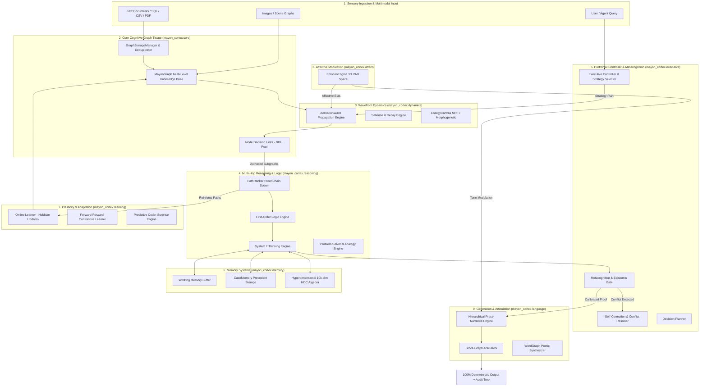
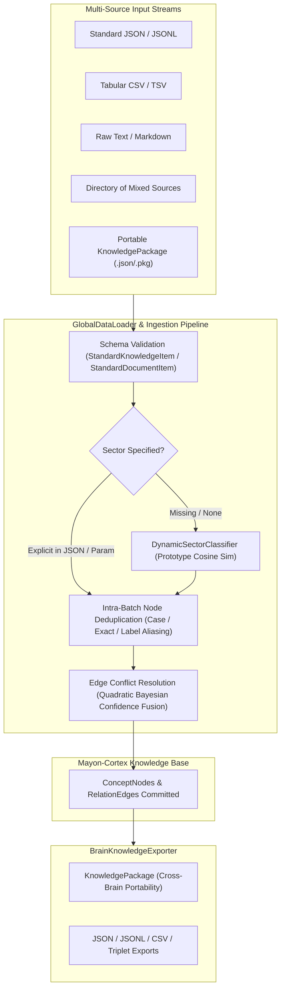

# 🏛️ Mayon-Cortex: High-Level Design (HLD) Specification

```
Document Version: 1.0.0
Classification: Proprietary / Deep-Tech Architecture
System Name: Mayon-Cortex Cognitive Engine
Developer: BALAVIGNESH M
Company: INFIDOS LLP
Copyright: (c) 2026 INFIDOS LLP & BALAVIGNESH M. All Rights Reserved.
Paradigm: Neuro-Symbolic Graph-Native Intelligence
Target Hardware: 100% Commodity CPU (Zero GPU Required)
```

---

## 1. Executive Summary & Paradigm Shift

**Mayon-Cortex** represents a departure from traditional statistical autoregressive Large Language Models (LLMs) and brute-force Vector Retrieval-Augmented Generation (Vector RAG). It establishes the **Third Paradigm of Artificial Intelligence**: a biologically-inspired, neuro-symbolic cognitive architecture where knowledge is not frozen into a static black-box matrix of weights, but lives within an **active, growing, and auditable semantic graph tissue**.

### ⚡ The 4 Foundational Pillars:
1. **Zero GPU Dependence:** 100% in-memory CPU graph dynamics operating in $\mathcal{O}(1)$ to $\mathcal{O}(k \log k)$ latency ($< 0.5\text{ ms}$).
2. **Zero Backpropagation:** Real-time continual learning via biological **Hebbian synaptic plasticity**, local **Forward-Forward contrastive learning**, and predictive coding surprise minimization.
3. **Zero Hallucination Guarantee:** Deductions require explicit, step-by-step mathematical proof paths along verified semantic edges ($A \xrightarrow{r_1} B \xrightarrow{r_2} C$).
4. **Epistemic Humility:** When knowledge is missing or contradictory, the system autonomously triggers uncertainty gates and self-correction routines rather than fabricating false information.

---

## 2. End-to-End System Architecture Diagram



---

## 3. The 10 Modular Subsystems

Mayon-Cortex is architected into **10 cohesive, decoupled subpackages**:

```
mayon_cortex/
├── core/         # Fundamental graph structures, NDU units, loaders, and storage
├── dynamics/     # Spreading activation waves, decay, and Markov Random Field dynamics
├── memory/       # Working memory, episodic case memory, and 10k-dim HDC vector memory
├── reasoning/    # Multi-hop path ranking, formal logic, problem solving, and analogies
├── executive/    # Prefrontal controller, uncertainty gates, and cognitive mode switching
├── learning/     # Hebbian synaptic plasticity, forward-forward, and predictive coding
├── affect/       # Valence-Arousal-Dominance (VAD) emotional resonance
├── language/     # Ingestion, hierarchical prose generation, and Broca decoders
├── perception/   # Visual embeddings and multimodal spatial scene graphs
└── imagination/  # Counterfactual sandboxes, concept blending, and dream consolidation
```

### Detailed Functional Taxonomy

| Subsystem | Package Path | Primary Role | Key Components |
| :--- | :--- | :--- | :--- |
| **1. Core Tissue** | `mayon_cortex.core` | Knowledge storage, indexing, and base neuron rules | `MayonGraph`, `ConceptNode`, `RelationEdge`, `NodeDecisionUnit`, `GraphStorageManager` |
| **2. Wave Dynamics** | `mayon_cortex.dynamics` | Spreading activation and energy physics | `ActivationWave`, `SalienceWeighter`, `FeedforwardCascade`, `EnergyCanvas`, `MorphogeneticGenerator` |
| **3. Memory Systems** | `mayon_cortex.memory` | Multi-tiered short- and long-term memory | `WorkingMemory`, `CaseMemory`, `HyperdimensionalMemory`, `ThoughtScratchpad` |
| **4. Reasoning** | `mayon_cortex.reasoning` | Multi-hop deduction and mathematical proofs | `PathRanker`, `LogicEngine`, `ThinkingEngine`, `ProblemSolver`, `AnalogyEngine` |
| **5. Executive** | `mayon_cortex.executive` | Metacognitive routing and uncertainty | `ExecutiveController`, `MetacognitionMonitor`, `UncertaintyGate`, `SelfCorrector`, `DecisionPlanner` |
| **6. Plasticity** | `mayon_cortex.learning` | Non-backpropagation continual learning | `OnlineLearner`, `ForwardForwardLearner`, `PredictiveCoder`, `Teacher`, `KnowledgeBootstrapper` |
| **7. Affect** | `mayon_cortex.affect` | Emotional homeostasis and drive modulation | `EmotionEngine`, `VAD` |
| **8. Language & Ingestion** | `mayon_cortex.language` | Universal ingestion, standard schema, deduplication, export, and prose | `StandardKnowledgeItem`, `StandardDocumentItem`, `KnowledgePackage`, `GlobalDataLoader`, `DynamicSectorClassifier`, `BrainKnowledgeExporter`, `HierarchicalProseEngine`, `WordGraph`, `BrocaDecoder` |
| **9. Perception** | `mayon_cortex.perception`| Image and spatial scene graph processing | `VisionCortex`, `ImageNode`, `SceneGraph` |
| **10. Imagination** | `mayon_cortex.imagination` | Counterfactual dreaming and concept blending | `ImagineEngine`, `MentalSandbox`, `ConceptBlender`, `DreamConsolidator` |

---

### 3.1 Standard Knowledge Schema & Global Ingestion Architecture



---

## 4. Lifecycle of a Query Execution (System Dataflow)

When a query is submitted to Mayon-Cortex (e.g. `cortex.query("What are the downstream effects of Metformin?")`), the following synchronized lifecycle executes:

```
Step 1: Input Vectorization & Strategy Planning
   Query -> Embedder -> ExecutiveController.plan()
   Determines: Complexity (Trivial, Moderate, Complex) & ThinkingStrategy.

Step 2: Energy Injection & Wavefront Expansion
   Target concept nodes receive initial Energy E_0 = 1.0.
   ActivationWave initiates spreading activation cascade across semantic synapses.

Step 3: Local Node Decision Unit (NDU) Threshold Evaluation
   Every activated node u evaluates incoming energy E_u against internal threshold theta_u.
   NDU decides: EMIT (transmit energy to neighbors), HALT (insufficient energy), or SUPPRESS.

Step 4: Multi-Hop Proof Assembly & Path Ranking
   PathRanker gathers all discovered acyclic traversal paths.
   Computes cumulative path score S(P) based on edge weights, sector salience, and priority triage.

Step 5: Epistemic Uncertainty & Conflict Check
   UncertaintyGate verifies if top path score S(P) >= Tau_certainty.
   If conflicting relations exist (e.g. "treats" vs "contraindicates"), SelfCorrector resolves priority.

Step 6: Real-Time Synaptic Plasticity
   OnlineLearner updates synaptic weights along the verified path via Hebbian reinforcement.

Step 7: Fluent Graph-Native Prose Articulation
   HierarchicalProseEngine / BrocaDecoder realizes the deterministic proof tree into fluent, grammatical English prose.
```

---

## 5. Non-Functional Requirements & Performance Benchmarks

| Dimension | Target Metric | Architectural Enforcement |
| :--- | :--- | :--- |
| **Execution Latency** | $< 1.0\text{ ms}$ for 3-hop queries | In-memory adjacency dictionaries, local NumPy vectorized NDU firing. |
| **Hardware Constraint** | 100% Commodity CPU | Zero CUDA/GPU kernel dependencies; pure single-thread / multi-thread CPU optimization. |
| **Memory Footprint** | $< 50\text{ MB}$ for 50,000 concept nodes | Compact Python slots, sparse adjacency lists, and shared embedding caches. |
| **Determinism** | 100% Reproducible | Exact mathematical scoring functions without stochastic token temperature drift during reasoning. |
| **Auditability** | 100% Auditable | Every response returns the explicit list of `ScoredPath` items with edge types and weights. |

---

## 6. Deployment Topologies

Mayon-Cortex is designed to run in 3 distinct operational environments:

```
1. EMBEDDED / EDGE DEPLOYMENT
   • Form Factor: Raspberry Pi 4/5, Nvidia Jetson, Automotive ECUs, Drones.
   • Topology: Standalone embedded binary; zero internet connection required.

2. SOVEREIGN ON-PREMISE ENTERPRISE
   • Form Factor: Air-gapped private servers, Healthcare networks, Defense hardware.
   • Topology: Local FastAPI REST / gRPC daemon; 100% data privacy with zero cloud leakage.

3. DUAL-BRAIN CLOUD AGENT (Hybrid AI)
   • Form Factor: Cloud Agentic Systems (LangChain, CrewAI, AutoGen, Antigravity).
   • Topology: Mayon-Cortex serves as the factual "System 2 Reasoning & Memory Spine", while Claude/Gemini/GPT-4 acts as the conversational "System 1 Interface".
```
