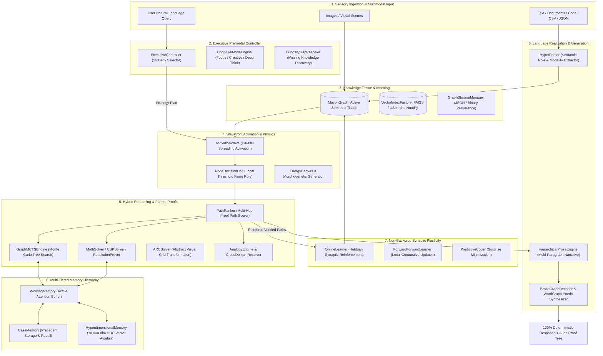
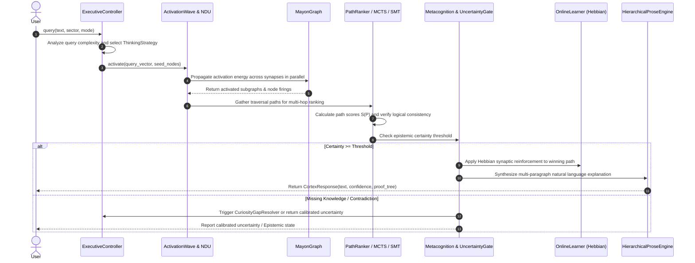

# 🏛️ Mayon-Cortex: Comprehensive System Architecture & API/Class Reference

```
Document Version: 1.0.0
Developer: BALAVIGNESH M
Company: INFIDOS LLP
System: Mayon-Cortex Cognitive Architecture
Classification: Proprietary / Deep-Tech Technical Specification
Runtime: 100% Commodity CPU (Zero GPU, Zero CUDA Dependencies)
```

---

## 1. System Architecture & Lifecycle Diagrams

### 1.1 Complete End-to-End Cognitive Architecture


---

### 1.2 Query Lifecycle & Proof Assembly Sequence


---

## 2. In-Depth Subsystem, Module, Class, and Method Directory

## 🧠 1. Central Engine & Pipeline Orchestration
> **Subsystem Overview:** The root brain entrypoints coordinating knowledge tissue, energy waves, reasoning, and articulation.

### 📄 [`mayon_cortex/__init__.py`](file:///mayon_cortex/__init__.py)
**Description:**
> Mayon-Cortex: The Unified Cognitive Architecture
=================================================
A biologically-inspired, neuro-symbolic brain-like growing intelligence
operating on pure CPU with zero GPU, zero backprop, and 100% deterministic proofs.

10 Modular Subsystems:
  • core/        - Graph tissue, NDU neuron firing rules, configuration & storage
  • dynamics/    - Spreading activation waves, salience decay & energy physics
  • memory/      - Working memory, case memory & 10k-dim HDC vector memory
  • reasoning/   - PathRanker, formal logic, System 2 thinking & problem solving
  • executive/   - Prefrontal strategy, uncertainty gating & self-correction
  • learning/    - Hebbian synaptic plasticity, forward-forward & predictive coding
  • affect/      - VAD emotional resonance & homeostasis
  • language/    - Universal ingestion, prose engine, word graphs & Broca articulation
  • perception/  - Vision cortex & multimodal spatial scene graphs
  • imagination/ - Mental sandboxes, concept blending & dream consolidation

---

### 📄 [`mayon_cortex/engine.py`](file:///mayon_cortex/engine.py)
**Description:**
> Cortex-Graph v4 — The Complete Graph-Native Intelligence
=========================================================
Main orchestrator that integrates all 6 pillars:
- MayonGraph (brain tissue — knowledge + language storage)
- NDU (Node Decision Unit — neuron firing rule)
- ActivationWave (parallel wavefront cascade)
- PathRanker (proof chain ranking)
- WordGraph & WordGraphGenerator (Pillar 1: Compositional word generation)
- FractalAbstractionEngine (Pillar 2: Automatic concept hierarchy)
- EmotionEngine (Pillar 3: VAD emotional resonance)
- VisionCortex (Pillar 4: Image understanding & multimodal graph)
- AnalogyEngine (Pillar 5: Structural & vector analogical reasoning)
- Teacher & OnlineLearner (Pillar 6: Active curriculum assessment & Hebbian plasticity)
- CrossDomainResolver & DecisionPlanner (Multi-sector reasoning & action planning)
- UncertaintyGate & SelfCorrector (Epistemic humility & conflict detection)

#### Classes & Components:
##### `class CortexResponse`
**Purpose & Usage:** Response from a query.


##### `class DecisionResponse`
**Purpose & Usage:** Response from a complex decision query.


##### `class CortexGraph`
**Purpose & Usage:** The complete graph-native intelligence.

**Methods:**
- `.__init__(config)`
  - **Purpose:** Executes internal logic for this component.
- `.query(question, sector)`
  - **Purpose:** Factual & reasoning query through the cortical graph.
- `.decide(question)`
  - **Purpose:** Complex multi-domain decision query with ordered action plan.
- `.ingest(text, sector, provenance)`
  - **Purpose:** Feed text into the brain (populates knowledge, phrases, and word graph).
- `.ingest_file(file_path, sector, provenance, encoding)`
  - **Purpose:** Ingest any file (.txt, .md, .csv, .tsv, .json, .jsonl, .html, .xml).
- `.ingest_directory(directory_path, pattern, recursive, sector, encoding)`
  - **Purpose:** Recursively scan and ingest all supported files in a directory.
- `.ingest_records(records, text_key, sector_key, default_sector, provenance)`
  - **Purpose:** Ingest arbitrary list of dicts, strings, or data records.
- `.see(image_input, caption, tags)`
  - **Purpose:** Ingest and ground an image into the unified cortical graph.
- `.query_image(image_input, top_k)`
  - **Purpose:** Query knowledge related to an image.
- `.solve_analogy(a, b, c, sector_hint)`
  - **Purpose:** Solve an analogy: A is to B as C is to [D].
- `.imagine_what_if(hypothetical_fact, query, sector)`
  - **Purpose:** Run a counterfactual simulation in an isolated mental sandbox.
- `.blend_concepts(concept_a, concept_b, alpha)`
  - **Purpose:** Synthesize emergent concept from two ideas across domains.
- `.dream(cycles)`
  - **Purpose:** Run an offline sleep/REM memory replay, hypothesis synthesis, and synaptic pruning cycle.
- `.explore_curiosity(top_k)`
  - **Purpose:** Identify knowledge voids and curiosity exploration targets.
- `.abstract()`
  - **Purpose:** Run an automatic fractal concept abstraction cycle.
- `.teach(phase)`
  - **Purpose:** Run curriculum learning.
- `.assess(live_eval)`
  - **Purpose:** Assess the brain's knowledge and capabilities.
- `.articulate_broca(question)`
  - **Purpose:** Broca decoder articulation.
- `.compose_poem(theme, form, mood, lines, meter, temperature)`
  - **Purpose:** 100% Graph-Native poetic composition (Zero Transformers).
Uses Conceptual Blending + Phonetic Rhyme Graph + Energy-based Boltzmann Traversal.
- `.compose_prose(prompt, style, temperature, max_words, novelty, coherence, cadence, emotion_intensity)`
  - **Purpose:** 100% Graph-Native creative prose generation with optional 1-to-10 parameter adaptation.
- `.compose_story(prompt, acts, novelty, coherence, cadence, emotion_intensity, genre)`
  - **Purpose:** Generate a multi-act coherent narrative story with full 1-to-10 parameter control.
100% Graph-Native (Zero GPUs / Zero Transformers).
- `.compose_article(topic, paragraphs, novelty, coherence, cadence, genre)`
  - **Purpose:** Generate a structured non-fiction / analytical article.
- `.ingest_corpus(corpus, domain, verbose)`
  - **Purpose:** Ingest a raw text string, list of sentences, or file into WordGraph and ConceptGraph.
- `.load_data(source, format, sector, default_confidence, provenance, auto_dedup, resolve_conflicts)`
  - **Purpose:** Universal data ingestion method. Ingests StandardKnowledgeItem, StandardDocumentItem,
KnowledgePackage, JSON, JSONL, CSV, Markdown, text, or Python dicts.
- `.load_sources(sources, sector, auto_dedup, resolve_conflicts)`
  - **Purpose:** Ingest multiple diverse knowledge sources in a single call.
- `.export_knowledge(target_path, format, sector, min_confidence, domain_name, description)`
  - **Purpose:** Export brain knowledge into standard JSON/JSONL/KnowledgePackage formats.
- `.save(save_dir)`
  - **Purpose:** Save entire brain state to disk.
- `.load(save_dir, config)`
  - **Purpose:** Load brain from disk.
- `.stats()`
  - **Purpose:** Get brain statistics.
- `.think(prompt, mode, timeout_ms)`
  - **Purpose:** Execute full System 2 multi-step reasoning with subgoals, logic proof, and self-monitoring.
- `.solve(problem_text)`
  - **Purpose:** Solve mathematical, logical, or multi-step constraint problems using
SMT constraint propagation or graph problem solving.
- `.solve_math(problem_text)`
  - **Purpose:** Execute exact algebraic, arithmetic, or formula deduction.
- `.solve_csp(variables, domains, binary_constraints, unary_constraints)`
  - **Purpose:** Solve a discrete Constraint Satisfaction Problem via AC-3 and Forward Checking.
- `.prove_logic(kb_clauses, query_literal)`
  - **Purpose:** Execute First-Order Logic theorem proving via resolution refutation.
- `.solve_arc(task, max_depth)`
  - **Purpose:** Solve an ARC-AGI visual/spatial grid transformation task via DSL program synthesis.
- `.solve_arc_grid(train_pairs, test_input, task_id, category)`
  - **Purpose:** Convenience wrapper to solve an ARC task from raw list/array matrices.
- `.prove(start_concept, goal_concept, context_vars)`
  - **Purpose:** Execute Graph-MCTS over MayonGraph tissue to produce a verified multi-hop proof.
- `.ingest_hyper(text, sector, provenance)`
  - **Purpose:** Ingest text with Semantic Role Labeling, capturing condition clauses and math constraints.
- `.judge(situation, relevant_facts)`
  - **Purpose:** Evaluate a complex situation using precedent case memory, statutory rules, and principle weights.
- `.correlate(concept_a, concept_b, max_hops)`
  - **Purpose:** Discover non-obvious cross-domain bridge paths and synthesize emergent insights.
- `.see_scene(scene)`
  - **Purpose:** Ingest a full SceneGraph into the knowledge graph with bounding boxes and spatial edges.
- `.generate_image(prompt, width, height, iterations)`
  - **Purpose:** Generate an image via Markov Random Field energy minimization on a 2D pixel grid.
Pure CPU. Zero backprop.
- `.grow_pattern(pattern_type, size)`
  - **Purpose:** Grow an emergent biological texture/pattern using Turing reaction-diffusion.
- `.deduplicate()`
  - **Purpose:** Find fuzzy duplicates, cluster aliases, and reconcile conflicting nodes in the graph.
- `.__repr__()`
  - **Purpose:** Executes internal logic for this component.

#### Standalone Functions:
- `def _get_embedder(dim)`: Get or create a shared embedding model.

---

### 📄 [`mayon_cortex/pipeline.py`](file:///mayon_cortex/pipeline.py)
**Description:**
> Unified Pipeline — Single Entry Point for Data → Intelligence
================================================================
Phase 0 of the Brain-Like Intelligence upgrade.

One file to: load data → clean → ingest → generate.
Works with ANY domain, ANY format.

Usage:
    brain = CortexPipeline.from_files("docs/*.txt", "data/*.csv")
    brain = CortexPipeline.from_text(["fact 1", "fact 2"], sector="legal")
    brain = CortexPipeline.from_records([{"text": "...", "sector": "medical"}])
    
    brain.ask("What treats hypertension?")
    brain.generate("Write about space exploration", style="lyrical")
    brain.solve("If 3x + 5 = 20, what is x?")
    brain.judge("Employee posted confidential data on social media")
    brain.explore("connections between music and math")
    brain.process("any input — auto-routes to right mode")

#### Classes & Components:
##### `class PipelineStats`
**Purpose & Usage:** Statistics from pipeline ingestion.


##### `class CortexPipeline`
**Purpose & Usage:** One entry point: Data → Intelligence. Any domain. Any format.

The universal JARVIS interface that automatically:
1. Loads and ingests data from any source
2. Detects cognitive mode from query intent
3. Routes to the appropriate reasoning system
4. Returns labeled, traceable output

**Methods:**
- `.__init__(config)`
  - **Purpose:** Executes internal logic for this component.
- `.from_bootstrap(config)`
  - **Purpose:** Create a pipeline pre-loaded with comprehensive multi-sector bootstrap knowledge.
- `.from_files()`
  - **Purpose:** Create a pipeline from file glob patterns.

Args:
    *patterns: File glob patterns (e.g., "docs/*.txt", "data/**/*.csv")
    sector_map: Optional dict mapping file patterns to sectors
               (e.g., {"legal_*": "legal", "med_*": "medical"})
    config: Optional CortexConfig
    
Example:
    brain = CortexPipeline.from_files(
        "legal_docs/*.txt",
        "medical_data/*.csv",
        sector_map={"legal_*": "legal", "medical_*": "medical"}
    )
- `.from_text(texts, sector, config)`
  - **Purpose:** Create a pipeline from text strings.

Args:
    texts: Single string or list of strings to ingest
    sector: Knowledge sector for all texts
    config: Optional CortexConfig
    
Example:
    brain = CortexPipeline.from_text([
        "Aspirin treats headaches.",
        "Aspirin is an NSAID.",
        "NSAIDs can cause stomach ulcers.",
    ], sector="medical")
- `.from_records(records, text_key, sector_key, config)`
  - **Purpose:** Create a pipeline from structured records (dicts).

Args:
    records: List of dicts with text and optional sector
    text_key: Key in dict containing the text
    sector_key: Key in dict containing the sector
    config: Optional CortexConfig
    
Example:
    brain = CortexPipeline.from_records([
        {"text": "Contract clause 5.1 states...", "sector": "legal"},
        {"text": "The bridge load capacity is...", "sector": "engineering"},
    ])
- `.ingest_text(text_or_sentences, sector)`
  - **Purpose:** Dynamically ingest raw text or list of sentences into the brain.
- `.ingest_file(filepath, sector)`
  - **Purpose:** Ingest a file (txt, md, csv, json, jsonl, etc.) into the brain.
- `.ask(question, sector)`
  - **Purpose:** Ask a factual question. Zero hallucination guarantee.
Uses System 1 (direct) or System 2 (thinking) based on complexity.
- `.think(question, mode, timeout_ms)`
  - **Purpose:** Engage System 2 deliberative reasoning.
Multi-step thinking with full reasoning trace.
- `.generate(prompt, style, max_tokens)`
  - **Purpose:** Generate creative text using CREATIVE cognitive mode.
Output is labeled as generated, not claimed as fact.
- `.compose(theme, form, lines)`
  - **Purpose:** Compose poetry using the GraphPoetEngine.
- `.solve(problem)`
  - **Purpose:** Solve a problem (math, constraint, logic).
Uses algebraic SMT solving and graph problem solver.
- `.prove(start_concept, goal_concept)`
  - **Purpose:** Execute Graph-MCTS to produce an auditable multi-hop proof path.
- `.judge(situation, relevant_facts)`
  - **Purpose:** Render a judgment based on precedent memory and legal/ethical principles.
- `.explore(question)`
  - **Purpose:** Explore connections and patterns in the knowledge graph.
Uses EXPLORATORY cognitive mode.
- `.see(image_input, caption, tags)`
  - **Purpose:** Process an image — encode, add to graph, and return understanding.
- `.process(input_text)`
  - **Purpose:** Universal JARVIS entry point.

Automatically detects cognitive mode and routes to the right system:
- "What treats X?" → FACTUAL → ask()
- "Write a poem about X" → CREATIVE → compose/generate()
- "Solve: 3x + 5 = 20" → PROBLEM_SOLVING → solve()
- "Should X be done?" → JUDGING → think()
- "What connects X and Y?" → EXPLORATORY → explore()
- `.ingest(text, sector)`
  - **Purpose:** Ingest a single text into the brain.
- `.ingest_file(filepath, sector)`
  - **Purpose:** Ingest a file into the brain.
- `.teach_case(situation, judgment, reasoning, sector, factors)`
  - **Purpose:** Teach the brain a case example for judgment learning.
Ingests the case as connected knowledge for precedent-based reasoning.
- `._ingest_file(filepath, sector)`
  - **Purpose:** Read and ingest a single file.
- `.stats()`
  - **Purpose:** Get ingestion statistics.
- `.graph()`
  - **Purpose:** Direct access to the underlying MayonGraph.
- `.__repr__()`
  - **Purpose:** Executes internal logic for this component.

---

### 📄 [`mayon_cortex/cortex.py`](file:///mayon_cortex/cortex.py)
**Description:**
> Compatibility shim for mayon_cortex.cortex -> mayon_cortex.engine

---

### 📄 [`mayon_cortex/config.py`](file:///mayon_cortex/config.py)
**Description:**
> Compatibility shim for mayon_cortex.config -> mayon_cortex.core.config

---

## 🌐 2. Core Knowledge Tissue, Indexing & Storage (mayon_cortex.core)
> **Subsystem Overview:** Fundamental knowledge graph, typed relations, node decision units (NDUs), FAISS/USearch/NumPy vector indexes, and persistence.

### 📄 [`mayon_cortex/core/__init__.py`](file:///mayon_cortex/core/__init__.py)
**Description:**
> Mayon-Cortex Core — Graph Tissue & Infrastructure
==================================================
Houses the fundamental graph data structures, node decision units,
configurations, loaders, storage managers, and deduplication.

---

### 📄 [`mayon_cortex/core/config.py`](file:///mayon_cortex/core/config.py)
**Description:**
> Cortex-Graph Configuration
===========================
All hyperparameters for the brain-like growing intelligence system.

Every component is configurable from this single file:
- NDU (Node Decision Unit) — the neuron firing rule
- Activation Wave — parallel wavefront expansion
- Path Ranker — proof chain ranking
- Language — phrase node extraction and assembly
- Learning — Hebbian plasticity and online tree updates
- Cross-Domain — multi-sector parallel reasoning
- Decision Planner — A→Z ordered action chains
- Teacher — curriculum learning phases
- Meta-Cognitive — uncertainty, self-correction, salience

#### Classes & Components:
##### `class DecisionPriority`
**Purpose & Usage:** Universal priority hierarchy — same as real-world expert triage.


##### `class CortexConfig`
**Purpose & Usage:** Master configuration for the Cortex-Graph brain.


---

### 📄 [`mayon_cortex/core/deduplication.py`](file:///mayon_cortex/core/deduplication.py)
**Description:**
> Entity Deduplication & Conflict Reconciliation
===============================================
Phase 5 of the Brain-Like Intelligence upgrade.

Handles entity resolution, alias merging, synonym clustering, and edge rewiring
at scale to keep the knowledge graph compact, coherent, and contradiction-free.

#### Classes & Components:
##### `class DeduplicationReport`
**Purpose & Usage:** Summary of entity resolution and merging operations.


##### `class GraphDeduplicator`
**Purpose & Usage:** Performs fuzzy entity resolution, alias clustering, and knowledge conflict reconciliation.

**Methods:**
- `.__init__(string_similarity_thresh, vector_similarity_thresh)`
  - **Purpose:** Executes internal logic for this component.
- `._jaccard_similarity(s1, s2)`
  - **Purpose:** Character 3-gram Jaccard similarity.
- `._cosine_similarity(v1, v2)`
  - **Purpose:** Cosine similarity between two dense vectors.
- `.find_duplicate_candidates(node_labels, node_vectors)`
  - **Purpose:** Identify pairs of node IDs/labels that likely represent the identical concept.
Returns [(node_a, node_b, confidence_score), ...]
- `.reconcile_conflicts(fact_a, fact_b)`
  - **Purpose:** Reconcile conflicting triples (s, r1, o1, conf1) vs (s, r2, o2, conf2).
Returns the winning fact and an explanation rationale.
- `.run_deduplication(node_labels, node_vectors)`
  - **Purpose:** Execute full clustering and return summary report.

---

### 📄 [`mayon_cortex/core/graph.py`](file:///mayon_cortex/core/graph.py)
**Description:**
> Mayon Graph Engine
==================
The core knowledge graph that stores concept nodes and typed relation edges.
Supports hierarchical levels, sector taxonomy, multimodal/image nodes, temporal versioning,
and FAISS-backed ANN search.

This is the "growing" part of Mayon-Net — knowledge accumulates here
while the Nucleus stays frozen.

#### Classes & Components:
##### `class LightweightGraphView`
**Purpose & Usage:** High-performance native adjacency view replacing NetworkX.
Preserves full API compatibility with NetworkX DiGraph:
- successors(u)
- predecessors(u)
- out_edges(u, data=False)
- in_edges(u, data=False)
- has_edge(u, v)
- add_node(n)
- add_edge(u, v, **data)
- remove_edge(u, v)
- u in graph
- graph[u][v]

**Methods:**
- `.__init__(mayon_graph)`
  - **Purpose:** Executes internal logic for this component.
- `.successors(node_id)`
  - **Purpose:** Executes internal logic for this component.
- `.predecessors(node_id)`
  - **Purpose:** Executes internal logic for this component.
- `.out_edges(node_id, data)`
  - **Purpose:** Executes internal logic for this component.
- `.in_edges(node_id, data)`
  - **Purpose:** Executes internal logic for this component.
- `.has_edge(u, v)`
  - **Purpose:** Executes internal logic for this component.
- `.add_node(node_id)`
  - **Purpose:** Executes internal logic for this component.
- `.add_edge(u, v)`
  - **Purpose:** Executes internal logic for this component.
- `.remove_edge(u, v)`
  - **Purpose:** Executes internal logic for this component.
- `.__contains__(node_id)`
  - **Purpose:** Executes internal logic for this component.
- `.__getitem__(u)`
  - **Purpose:** Executes internal logic for this component.

##### `class GraphLevel`
**Purpose & Usage:** Hierarchical levels in the Mayon graph.


##### `class ConceptNode`
**Purpose & Usage:** A node in the Mayon graph (Text, Image, or Concept).

**Methods:**
- `.to_dict()`
  - **Purpose:** Executes internal logic for this component.

##### `class RelationEdge`
**Purpose & Usage:** A typed, directed edge between two concept nodes.

**Methods:**
- `.is_active()`
  - **Purpose:** Check if this edge is currently valid (not expired or superseded).

##### `class Subgraph`
**Purpose & Usage:** A retrieved subgraph — the result of a Mayon query.

**Methods:**
- `.node_vectors()`
  - **Purpose:** Stack all node vectors into a matrix for the Binder.
- `.adjacency()`
  - **Purpose:** Build adjacency matrix for GNN processing.
- `.relation_types()`
  - **Purpose:** Get all relation types in this subgraph.
- `.provenance_chain()`
  - **Purpose:** Get the full provenance chain for explainability.

##### `class MayonGraph`
**Purpose & Usage:** The Mayon: an external knowledge graph that grows without bound.

Key design principles:
- Knowledge lives here, not in the Nucleus weights.
- Nodes are concept embeddings from the frozen Perceiver or CLIP vision encoder.
- Edges are typed relations with confidence, sector, and provenance.
- Retrieval is ANN search + graph traversal, not attention over tokens.
- Supports hierarchical levels, multi-sector filtering, and temporal versioning.

**Methods:**
- `.__init__(concept_dim, ann_index_type)`
  - **Purpose:** Executes internal logic for this component.
- `._build_index()`
  - **Purpose:** Build or rebuild the polymorphic vector index (USearch, FAISS, or NumPy).
- `.faiss_index()`
  - **Purpose:** Backward-compatibility proxy for vector_index.
- `.faiss_index(value)`
  - **Purpose:** Executes internal logic for this component.
- `.add_node(vector, source_text, level, sector, node_type, provenance, confidence, metadata)`
  - **Purpose:** Add a new concept node to the Mayon (Text or Image).
- `.add_nodes_bulk(vectors, source_texts, levels, sectors, node_types, provenances, confidences, metadata_list, node_ids)`
  - **Purpose:** Add multiple concept nodes in a single high-performance vectorized batch.
Performs vectorized BLAS normalization and a single batch vector index addition.
- `.add_edge(source_id, target_id, relation_type, confidence, sector, provenance, valid_from, valid_to, metadata)`
  - **Purpose:** Add a typed relation edge between two concept nodes.
- `.add_edges_bulk(edges_data)`
  - **Purpose:** Add multiple typed relation edges in batch with conflict resolution.
- `.get_successors(node_id)`
  - **Purpose:** Get all target node IDs reachable from node_id via active edges.
- `.get_predecessors(node_id)`
  - **Purpose:** Get all source node IDs that have active edges pointing to node_id.
- `.get_out_edges_data(node_id, data)`
  - **Purpose:** Get outgoing edges from node_id, matching NetworkX out_edges format.
- `.get_in_edges_data(node_id, data)`
  - **Purpose:** Get incoming edges to node_id, matching NetworkX in_edges format.
- `.has_edge(u, v)`
  - **Purpose:** Check if an active edge exists from u to v.
- `.remove_edge_between(u, v)`
  - **Purpose:** Remove all edges between u and v.
- `.traverse(query_vector, relation_type, top_k, confidence_threshold, max_hops, level, sector)`
  - **Purpose:** Query the Mayon: find relevant nodes and their connected subgraph.
- `.search_similar(query_vector, top_k, sector, level)`
  - **Purpose:** Direct semantic vector similarity search returning (ConceptNode, score) pairs.
- `.decay(factor, min_confidence)`
  - **Purpose:** Apply temporal decay to all edge confidences.
Edges below min_confidence are pruned (forgotten).
- `._find_edge(source_id, target_id, relation_type)`
  - **Purpose:** Executes internal logic for this component.
- `._resolve_conflict(existing, new_confidence, new_provenance)`
  - **Purpose:** Executes internal logic for this component.
- `.num_nodes()`
  - **Purpose:** Executes internal logic for this component.
- `.num_edges()`
  - **Purpose:** Executes internal logic for this component.
- `.get_node(node_id)`
  - **Purpose:** Retrieve a concept node by its ID.
- `.get_edges_from(node_id)`
  - **Purpose:** Get all outgoing relation edges from a node.
- `.get_edges_to(node_id)`
  - **Purpose:** Get all incoming relation edges to a node.
- `.sector_stats()`
  - **Purpose:** Get nodes and edges breakdown per sector.
- `.stats()`
  - **Purpose:** Get full Mayon statistics.
- `.save(save_dir)`
  - **Purpose:** Save the entire Mayon graph (nodes, edges, vector index) to disk.
- `.load(save_dir)`
  - **Purpose:** Load a Mayon graph from disk.
- `.__repr__()`
  - **Purpose:** Executes internal logic for this component.

---

### 📄 [`mayon_cortex/core/graph_env.py`](file:///mayon_cortex/core/graph_env.py)
**Description:**
> Graph Reasoning Environment & Symbolic Verifier
===============================================
A Markov Decision Process (MDP) environment for training neural policy networks
(like Mayon-Net's Nucleus) to traverse knowledge graphs with verifiable deductive logic.

Core components:
- GraphAction: Discrete transition from current node to target neighbor via a typed relation.
- GraphState: The agent's current perceptual and topological state.
- SymbolicVerifier: Deterministic proof checker calculating formal rewards (GRPO-compatible).
- GraphReasoningEnv: Step-based RL environment with action masking, cycle prevention, and reward feedback.

#### Classes & Components:
##### `class GraphAction`
**Purpose & Usage:** Action taken by the reasoning policy: choose a neighbor node via relation edge.


##### `class GraphState`
**Purpose & Usage:** The current state of an episode in the Graph Reasoning Environment.


##### `class SymbolicVerifier`
**Purpose & Usage:** Deterministic Proof Verifier.
Evaluates whether a traversed multi-hop path forms a valid, mathematically sound
deductive chain that logically satisfies the query.

**Methods:**
- `.__init__()`
  - **Purpose:** Executes internal logic for this component.
- `.verify_path(traversed_edges, target_entity, expected_relation, mayon_nodes)`
  - **Purpose:** Verify the chain of edges.
Returns: (is_valid_proof, reward, reason)

##### `class GraphReasoningEnv`
**Purpose & Usage:** Reinforcement Learning environment wrapping the Mayon Knowledge Graph.
Allows an RL policy (Nucleus) to explore graph nodes and receive verifiable rewards.

**Methods:**
- `.__init__(mayon, verifier, max_hops, step_penalty)`
  - **Purpose:** Executes internal logic for this component.
- `.reset(query, query_vector, start_node_id, target_entity, expected_relation)`
  - **Purpose:** Reset environment for a new reasoning episode.
If start_node_id is not provided, seeds from nearest vector match in graph.
- `.get_valid_actions(node_id)`
  - **Purpose:** Extract valid outgoing actions from the given node.
Also includes a HALT action allowing the agent to declare its proof finished.
- `.step(action)`
  - **Purpose:** Execute an action taken by the policy.
Returns: (next_state, reward, done, info)
- `.format_proof_trace()`
  - **Purpose:** Format the current reasoning trajectory into a formal proof trace.

---

### 📄 [`mayon_cortex/core/loader.py`](file:///mayon_cortex/core/loader.py)
**Description:**
> Mayon Knowledge Loader
======================
Auto-populates the Mayon from REAL knowledge sources across multiple sectors:
- Python official docs & Codebases (Code sector)
- Medical / Clinical guidelines & diagnostic relationships (Medical sector)
- Legal regulations & compliance standards (Legal sector)
- Finance & economic ontology (Finance sector)
- Multimodal Image / Vision inputs (Visual Cortex via CLIP embeddings)

Uses real embedding models (sentence-transformers / CLIP) for concept vectors.

#### Classes & Components:
##### `class EmbeddingModel`
**Purpose & Usage:** Multimodal Semantic Embedding Model.
- Text: sentence-transformers / TF-IDF
- Vision / Image: CLIP (OpenAI CLIP ViT-B/32) projected to concept_dim

**Methods:**
- `.__init__(model_name, dim)`
  - **Purpose:** Executes internal logic for this component.
- `._init_vision()`
  - **Purpose:** Lazy load CLIP for vision understanding.
- `.encode(texts)`
  - **Purpose:** Encode text into concept vectors (normalized, dim=target_dim).
- `.encode_single(text)`
  - **Purpose:** Encode a single text with instant dictionary cache.
- `._encode_hf(texts)`
  - **Purpose:** Encode using HuggingFace Transformers AutoModel with Mean Pooling.
- `._encode_st(texts)`
  - **Purpose:** Encode with sentence-transformers and project to target dim.
- `._encode_tfidf(texts)`
  - **Purpose:** Encode with TF-IDF + SVD.
- `._encode_hash(texts)`
  - **Purpose:** Deterministic subword n-gram semantic hash with stopword filtering.

##### `class PythonDocsLoader`
**Purpose & Usage:** Loads Python knowledge from actual Python modules.
Extracts docstrings, function signatures, class hierarchies,
and module-level documentation.

**Methods:**
- `.__init__(embedding_model)`
  - **Purpose:** Executes internal logic for this component.
- `.extract_all()`
  - **Purpose:** Extract knowledge from all core Python modules.
- `._extract_builtins()`
  - **Purpose:** Extract all built-in functions and their docs.
- `._extract_module(module_name)`
  - **Purpose:** Extract functions, classes, and docs from a module.
- `._python_idioms()`
  - **Purpose:** Common Python patterns and idioms.
- `._error_patterns()`
  - **Purpose:** Common error patterns and how to fix them.

##### `class CodebaseLoader`
**Purpose & Usage:** Load knowledge from an actual codebase (your code or any Python project).
Parses .py files and extracts:
- Function/class definitions with docstrings
- Import relationships
- Call graphs

**Methods:**
- `.__init__(embedding_model)`
  - **Purpose:** Executes internal logic for this component.
- `.extract_from_directory(directory, max_files)`
  - **Purpose:** Parse all .py files in a directory and extract knowledge.
- `._parse_python_file(filepath, source)`
  - **Purpose:** Parse a single Python file using AST.

##### `class MultiSectorKnowledgeLoader`
**Purpose & Usage:** Loads baseline foundational knowledge for diverse sectors:
- Medical & Healthcare (conditions, diagnoses, treatments)
- Legal & Compliance (regulations, GDPR, contracts)
- Finance & Economics (monetary policy, banking, instruments)
- Science & Logic (laws, principles, theorems)

**Methods:**
- `.__init__(embedding_model)`
  - **Purpose:** Executes internal logic for this component.
- `.get_all_sector_knowledge()`
  - **Purpose:** Load comprehensive knowledge across all 6 sectors from SECTOR_KNOWLEDGE.
- `.get_medical_knowledge()`
  - **Purpose:** Executes internal logic for this component.
- `.get_legal_finance_knowledge()`
  - **Purpose:** Executes internal logic for this component.

#### Standalone Functions:
- `def populate_mayon_from_knowledge(mayon, facts, embedding_model, batch_size, verbose)`: Populate a Mayon graph with real knowledge across sectors using real embeddings.

---

### 📄 [`mayon_cortex/core/mayon_config.py`](file:///mayon_cortex/core/mayon_config.py)
**Description:**
> Mayon Graph Configuration
=========================
Configuration dataclasses and constants for the Mayon Knowledge Graph.

#### Classes & Components:
##### `class MayonConfig`
**Purpose & Usage:** Configuration for the Mayon (Scalable Multi-Domain Knowledge Graph).


---

### 📄 [`mayon_cortex/core/ndu.py`](file:///mayon_cortex/core/ndu.py)
**Description:**
> Node Decision Unit (NDU) — The Neuron Firing Rule
===================================================
A lightweight gradient-boosted tree model that makes a local decision
at each active graph node during wavefront expansion.

Brain analogy: Each neuron independently decides whether to fire (propagate
activation) based on local inputs — its own state, the incoming signal
strength, and the type of synaptic connection.

Input:  52-feature vector computed from local node + edge + query context
Output: {follow_prob, halt_prob, backtrack_prob, relevance_score}

Before enough training data accumulates, uses a heuristic fallback
(cosine similarity + edge confidence) to make reasonable decisions.

#### Classes & Components:
##### `class NDUDecision`
**Purpose & Usage:** Output of a single node decision.


##### `class NodeDecisionUnit`
**Purpose & Usage:** The neuron firing rule.

A lightweight tree-based model that decides at each graph node:
- Should activation propagate through this edge? (follow)
- Should reasoning stop here? (halt)
- Should we backtrack? (backtrack)

Uses scikit-learn GradientBoostingClassifier internally.
Falls back to heuristics until enough training data is collected.

52 features per decision (see extract_features for full list).

**Methods:**
- `.__init__(config)`
  - **Purpose:** Executes internal logic for this component.
- `.extract_features(query_vec, node_vec, edge_confidence, relation_type, node_level, node_sector, query_sector, access_count, hop_depth, max_hops, out_degree, max_degree, node_timestamp, current_time, path_confidence, is_phrase_node, neighbor_relevance, is_visited, is_dead_end, relation_types_list)`
  - **Purpose:** Extract a 52-dimensional feature vector for this node+edge decision.

Features 1-2:   Semantic similarity and edge strength
Features 3-40:  One-hot relation type encoding (38 types)
Features 41-52: Structural, temporal, and meta features
- `.predict(features)`
  - **Purpose:** Predict whether to follow, halt, or backtrack at this node.

Uses trained tree model if available, otherwise falls back to
heuristic rules based on cosine similarity and edge confidence.
- `._predict_heuristic(features)`
  - **Purpose:** Heuristic fallback for untrained model.
Uses a simple rule: follow if cosine similarity × edge confidence
exceeds threshold, halt if similarity is very high, backtrack if visited.
- `._predict_tree(features)`
  - **Purpose:** Predict using the trained gradient-boosted tree model.
- `.record_outcome(features, was_good)`
  - **Purpose:** Record the outcome of a decision for future training.
was_good=True if following this edge led to a correct/useful answer.
- `.train(force)`
  - **Purpose:** Train (or retrain) the tree model on accumulated data.
Called periodically by the OnlineLearner.
- `.save(path)`
  - **Purpose:** Save NDU model and training buffer to disk.
- `.load(path)`
  - **Purpose:** Load NDU model and training buffer from disk.

---

### 📄 [`mayon_cortex/core/storage.py`](file:///mayon_cortex/core/storage.py)
**Description:**
> Graph Storage Manager — Disk-Backed Persistence & Snapshotting
==============================================================
Phase 5 of the Brain-Like Intelligence upgrade.

Handles high-throughput, persistent state serialization for Cortex-Graph:
  - Atomic checkpointing and binary snapshots (pickle / json / npz)
  - Incremental journal logging of node/edge mutations
  - Memory-mapped vector caches for billion-scale node embeddings
  - Versioned backup and recovery mechanisms

#### Classes & Components:
##### `class StorageConfig`
**Purpose & Usage:** Storage management parameters.


##### `class GraphStorageManager`
**Purpose & Usage:** Manages cold and warm storage for Cortex-Graph and MayonGraph.
Provides snapshot, restore, and WAL (Write-Ahead-Log) journaling.

**Methods:**
- `.__init__(config)`
  - **Purpose:** Executes internal logic for this component.
- `.append_journal(operation, data)`
  - **Purpose:** Write an operation to the write-ahead log.
- `.save_snapshot(graph_obj, metadata, snapshot_name)`
  - **Purpose:** Create a full snapshot of the cortex graph state.
- `.load_snapshot(snapshot_path)`
  - **Purpose:** Load a snapshot from path and return (graph_object, metadata).
- `.get_latest_snapshot()`
  - **Purpose:** Find the most recent valid snapshot directory.
- `._cleanup_old_snapshots()`
  - **Purpose:** Retain only max_history_snapshots.

---

### 📄 [`mayon_cortex/core/vector_index.py`](file:///mayon_cortex/core/vector_index.py)
**Description:**
> Mayon-Cortex Unified High-Performance Vector Index Engine
=========================================================
Polymorphic vector indexing architecture supporting:
  1. USearchIndex    — Ultra-fast, SIMD-accelerated (AVX-512/AVX2/NEON) HNSW index with mmap support.
  2. FaissIndex      — Industry-standard FAISS Flat/IVF inner-product index.
  3. NumpyIndex      — Zero-dependency pure CPU BLAS vectorized matrix engine with exact retrieval.

All backends expose an identical interface with (scores, indices) output format.

#### Classes & Components:
##### `class BaseVectorIndex`
**Purpose & Usage:** Abstract Base Class for all Mayon-Cortex Vector Index Backends.

**Methods:**
- `.__init__(dim, metric)`
  - **Purpose:** Executes internal logic for this component.
- `.backend_name()`
  - **Purpose:** Name of the underlying index backend.
- `.size()`
  - **Purpose:** Number of vectors currently indexed.
- `.add(vector, key)`
  - **Purpose:** Add a single vector with an integer identifier.
- `.add_batch(vectors, keys)`
  - **Purpose:** Add a batch of vectors with optional integer identifiers.
- `.search(query, k)`
  - **Purpose:** Search for top-k nearest neighbors.

Args:
    query: Query vector of shape (D,) or (B, D).
    k: Number of neighbors to return.
    
Returns:
    Tuple[scores, indices]:
        scores: Similarity scores of shape (B, k) or (1, k).
        indices: Integer keys/indices of shape (B, k) or (1, k).
- `.save(path)`
  - **Purpose:** Serialize index to disk.
- `.load(path)`
  - **Purpose:** Deserialize index from disk.
- `.__len__()`
  - **Purpose:** Executes internal logic for this component.

##### `class USearchVectorIndex`
**Purpose & Usage:** USearch Vector Index:
- Zero-copy memory mapped files (mmap)
- Hardware SIMD optimization (AVX2, AVX-512, ARM NEON, SVE)
- Scalable HNSW graph structure with sub-millisecond latency at > 100k nodes.

**Methods:**
- `.__init__(dim, metric, dtype, connectivity, expansion_add, expansion_search)`
  - **Purpose:** Executes internal logic for this component.
- `.backend_name()`
  - **Purpose:** Executes internal logic for this component.
- `.size()`
  - **Purpose:** Executes internal logic for this component.
- `.add(vector, key)`
  - **Purpose:** Executes internal logic for this component.
- `.add_batch(vectors, keys)`
  - **Purpose:** Executes internal logic for this component.
- `.search(query, k)`
  - **Purpose:** Executes internal logic for this component.
- `.save(path)`
  - **Purpose:** Executes internal logic for this component.
- `.load(path)`
  - **Purpose:** Executes internal logic for this component.

##### `class FaissVectorIndex`
**Purpose & Usage:** FAISS-backed Vector Index wrapping IndexFlatIP or IndexIVFFlat.

**Methods:**
- `.__init__(dim, metric, index_type)`
  - **Purpose:** Executes internal logic for this component.
- `._build_index()`
  - **Purpose:** Executes internal logic for this component.
- `.backend_name()`
  - **Purpose:** Executes internal logic for this component.
- `.size()`
  - **Purpose:** Executes internal logic for this component.
- `.add(vector, key)`
  - **Purpose:** Executes internal logic for this component.
- `.add_batch(vectors, keys)`
  - **Purpose:** Executes internal logic for this component.
- `.search(query, k)`
  - **Purpose:** Executes internal logic for this component.
- `.save(path)`
  - **Purpose:** Executes internal logic for this component.
- `.load(path)`
  - **Purpose:** Executes internal logic for this component.

##### `class NumpyVectorIndex`
**Purpose & Usage:** Pure Python & NumPy BLAS Vector Index:
- 100% deterministic, zero external C++ extensions
- Vectorized matrix multiplication with hardware-accelerated BLAS (OpenBLAS/MKL)
- Sub-millisecond exact cosine similarity for up to 50k vectors.

**Methods:**
- `.__init__(dim, metric)`
  - **Purpose:** Executes internal logic for this component.
- `.backend_name()`
  - **Purpose:** Executes internal logic for this component.
- `.size()`
  - **Purpose:** Executes internal logic for this component.
- `.add(vector, key)`
  - **Purpose:** Executes internal logic for this component.
- `.add_batch(vectors, keys)`
  - **Purpose:** Executes internal logic for this component.
- `.search(query, k)`
  - **Purpose:** Executes internal logic for this component.
- `.save(path)`
  - **Purpose:** Executes internal logic for this component.
- `.load(path)`
  - **Purpose:** Executes internal logic for this component.

##### `class VectorIndexFactory`
**Purpose & Usage:** Factory to instantiate the best available high-performance vector index.
Priority order in 'auto' mode:
  1. USearch (SIMD HNSW with sub-ms scaling)
  2. FAISS (Flat/IVF)
  3. NumPy BLAS (Deterministic pure CPU fallback)

**Methods:**
- `.create_index(dim, backend, metric, dtype)`
  - **Purpose:** Executes internal logic for this component.

---

## ⚡ 3. Wavefront Activation Dynamics & Energy Physics (mayon_cortex.dynamics)
> **Subsystem Overview:** Parallel spreading activation cascade, Markov Random Field energy canvas, salience decay, and biological pattern morphogenesis.

### 📄 [`mayon_cortex/dynamics/__init__.py`](file:///mayon_cortex/dynamics/__init__.py)
**Description:**
> Mayon-Cortex Dynamics — Activation Wavefronts & Energy Physics
==============================================================
Parallel spreading activation waves, salience decay, feedforward cascades,
Markov Random Field energy canvases, and morphogenetic reaction-diffusion.

---

### 📄 [`mayon_cortex/dynamics/activation_wave.py`](file:///mayon_cortex/dynamics/activation_wave.py)
**Description:**
> Activation Wave — Parallel Neural Cascade
===========================================
The brain's spreading activation. When a stimulus arrives, it doesn't
process nodes one-by-one — it fires a wavefront of activation that
spreads through connected neurons in parallel.

Each active node runs its NDU (Node Decision Unit) independently to
decide: follow this edge? halt here? backtrack?

This replaces the sequential Transformer attention mechanism with
O(1) local decisions at each node, running in parallel across the graph.

Usage:
    wave = ActivationWave(config)
    result = wave.activate(query_vec, graph, ndu)
    # result.paths = all discovered proof chains
    # result.active_nodes = all nodes that fired

#### Classes & Components:
##### `class ActivatedPath`
**Purpose & Usage:** A single path discovered during wavefront expansion.


##### `class ActivationResult`
**Purpose & Usage:** Result of a complete wavefront activation.


##### `class ActivationWave`
**Purpose & Usage:** Parallel wavefront expansion through the knowledge graph.

Algorithm:
1. FAISS retrieval → seed nodes (like V1 cortex recognizing the stimulus)
2. For each seed, expand outward:
   - At each node, NDU decides: follow / halt / backtrack
   - All active nodes fire simultaneously (parallel wavefront)
3. Collect all activated paths as proof chain candidates
4. Respect budget: max_active_nodes, max_hops

Supports optional sector filtering for cross-domain activation waves.

**Methods:**
- `.__init__(config)`
  - **Purpose:** Executes internal logic for this component.
- `.activate(query_vec, graph, ndu, sector_filter, max_hops, seed_node_ids)`
  - **Purpose:** Run parallel wavefront activation through the graph.

Args:
    query_vec: Query concept vector (ℝ³⁸⁴)
    graph: MayonGraph instance
    ndu: Node Decision Unit for local decisions
    sector_filter: Optional sector to filter nodes (for cross-domain)
    max_hops: Override max hops (default from config)
    seed_node_ids: Override seed nodes (default from FAISS)

Returns:
    ActivationResult with all discovered paths and metadata
- `._get_seeds(query_vec, graph, sector_filter)`
  - **Purpose:** Get seed nodes via FAISS ANN search.
- `._detect_query_sector(query_vec, graph, seed_ids)`
  - **Purpose:** Detect the most likely sector for the query based on seed nodes.
- `._compute_neighbor_relevance(query_vec, node_id, graph)`
  - **Purpose:** Compute mean cosine similarity of a node's neighbors to the query.

---

### 📄 [`mayon_cortex/dynamics/energy_canvas.py`](file:///mayon_cortex/dynamics/energy_canvas.py)
**Description:**
> Energy Canvas — Graph-Native Image Generation via Energy Minimization
=======================================================================
Phase Ω of the Brain-Like Intelligence upgrade.

A 2D grid of pixel-nodes where image generation = energy minimization.
Each pixel adjusts its color based on LOCAL neighbors + semantic constraints.
NO backpropagation. NO neural network. Pure local energy minimization.

This is how Markov Random Fields (MRFs) generate images — proven for 30+ years.

How it works:
  1. Knowledge graph provides WHAT to draw (scene description)
  2. Create NxN grid of pixel-nodes
  3. Energy function penalizes:
     - Incoherent adjacent pixels (spatial smoothness)
     - Pixels that don't match semantic region (semantic consistency)
     - Random noise (regularization)
  4. Iterated Conditional Modes (ICM): each pixel updates to minimize local energy
  5. Image EMERGES from energy minimization

Output: PIL Image or numpy array

#### Classes & Components:
##### `class SemanticRegion`
**Purpose & Usage:** A semantic region to render on the canvas.


##### `class MRFConfig`
**Purpose & Usage:** Configuration for Markov Random Field energy minimization.


##### `class SceneDescription`
**Purpose & Usage:** A structured scene to render.


##### `class EnergyCanvas`
**Purpose & Usage:** Graph-native image generation through energy minimization.

**Methods:**
- `.__init__(width, height, config)`
  - **Purpose:** Executes internal logic for this component.
- `.generate(prompt, iterations)`
  - **Purpose:** Generate image from text prompt by constructing semantic regions.
- `.generate_from_graph(query, graph, embedder, width, height, iterations)`
  - **Purpose:** Generate an image from knowledge graph traversal.

1. Query the graph to find relevant entities + relations
2. Build a scene description from the graph structure
3. Render via energy minimization
- `.render(scene, width, height, iterations)`
  - **Purpose:** Render a scene description into an image via energy minimization.

Algorithm: Iterated Conditional Modes (ICM)
  For each iteration:
    For each pixel:
      Compute energy for current color + neighbors
      Find color that minimizes local energy
      Update pixel
- `.render_knowledge_map(graph, width, height)`
  - **Purpose:** Render a visual map of the knowledge graph.
Each node becomes a colored point, edges become lines.
- `.to_pil_image(array)`
  - **Purpose:** Convert numpy array to PIL Image.
- `.save(array, path)`
  - **Purpose:** Save generated image to file.
- `._initialize_canvas(scene, width, height)`
  - **Purpose:** Initialize canvas with background and rough region colors.
- `._minimize_local_energy(canvas, x, y, width, height, scene, iteration, max_iterations)`
  - **Purpose:** Find the optimal color for pixel (x, y) that minimizes local energy.

Energy components:
1. Spatial smoothness: pixel should be similar to neighbors
2. Semantic consistency: pixel should match its semantic region
3. Data term: maintain original initialization
- `._get_semantic_color(x, y, width, height, scene)`
  - **Purpose:** Get the target color for a pixel based on which semantic region it falls in.
- `._build_scene_from_graph(query, graph, embedder)`
  - **Purpose:** Build a scene description from graph query results.
- `._force_directed_layout(graph, width, height, iterations)`
  - **Purpose:** Simple force-directed graph layout.
- `._draw_line(canvas, x1, y1, x2, y2, color)`
  - **Purpose:** Draw a simple line using Bresenham's algorithm.
- `._draw_circle(canvas, cx, cy, radius, color)`
  - **Purpose:** Draw a filled circle.

---

### 📄 [`mayon_cortex/dynamics/feedforward_cascade.py`](file:///mayon_cortex/dynamics/feedforward_cascade.py)
**Description:**
> Feedforward Cascade — Biologically-Accurate Forward-Only Neural Firing
========================================================================
Phase 1.5 of the Brain-Like Intelligence upgrade.

Like biological neurons: NO BACKPROPAGATION. Each node independently
decides to fire or not based on LOCAL inputs + mode context.
Creativity emerges from cascading forward decisions, not trained weights.

How it works:
  1. Stimulus arrives (query vector)
  2. Seed nodes activate (FAISS nearest)
  3. Each active node computes LOCAL energy from:
     - Incoming signal strength (cosine similarity)
     - Edge weight (synapse strength)
     - Mode context (factual=strict, creative=relaxed)
     - Noise injection (for creativity — like neural noise)
  4. If energy > threshold → FIRE → propagate to neighbors
  5. Fired nodes can trigger LATERAL INHIBITION (suppress similar neighbors)
  6. Cascade continues until energy dissipates

#### Classes & Components:
##### `class NeuronState`
**Purpose & Usage:** State of a single graph neuron during cascade.


##### `class CascadePath`
**Purpose & Usage:** A path traced through the cascade.


##### `class CascadeResult`
**Purpose & Usage:** Result of a feedforward cascade.


##### `class FeedforwardCascade`
**Purpose & Usage:** Forward-only neural cascade through the knowledge graph.
No backpropagation. No gradient descent. Pure local decisions.

Each neuron independently computes:
  energy = cosine(node, signal) × edge_weight × mode_factor + noise

If energy > threshold → FIRE → propagate to neighbors

In FACTUAL mode: strict threshold, no noise → only strong paths
In CREATIVE mode: low threshold, high noise → wide activation, novel combos

**Methods:**
- `.__init__(concept_dim)`
  - **Purpose:** Executes internal logic for this component.
- `.cascade(stimulus_vec, graph, mode_config, max_steps, seed_top_k)`
  - **Purpose:** Run a feedforward cascade through the graph.

Args:
    stimulus_vec: Query vector (ℝ³⁸⁴)
    graph: MayonGraph instance
    mode_config: Cognitive mode parameters
    max_steps: Maximum cascade steps
    seed_top_k: Number of seed nodes from FAISS
    
Returns:
    CascadeResult with all activated paths
- `._compute_firing_energy(node_vec, incoming_signal, edge_weight, mode_config)`
  - **Purpose:** Local energy computation at each neuron.

E = cosine(node, signal) × edge_weight + noise

In creative mode: noise is high → weak edges can still cause firing
In factual mode: noise is zero → only strong evidence activates
- `._lateral_inhibition(newly_fired, states, graph)`
  - **Purpose:** Biological lateral inhibition: when a neuron fires strongly,
it SUPPRESSES similar nearby neurons.

This prevents repetitive activation and produces DIVERSE patterns,
leading to more creative and varied outputs.
- `._get_seeds(query_vec, graph, top_k)`
  - **Purpose:** Get seed nodes via FAISS nearest neighbor search.
- `._build_complete_paths(fired_order, states, graph)`
  - **Purpose:** Build longer paths by connecting consecutively fired nodes.

---

### 📄 [`mayon_cortex/dynamics/morphogenetic.py`](file:///mayon_cortex/dynamics/morphogenetic.py)
**Description:**
> Morphogenetic Generator — Images That GROW From Rules
=======================================================
Phase Ω of the Brain-Like Intelligence upgrade.

Inspired by biological morphogenesis (Turing, 1952):
  DNA doesn't store pixel values → it stores GROWTH RULES
  Rules + local interaction → complex organisms EMERGE

Techniques:
  1. Reaction-Diffusion: Two chemicals interact → spots, stripes, waves
  2. L-Systems: Recursive rewriting → trees, plants, fractals
  3. Cellular Automata: Simple local rules → complex textures

ALL run on CPU. NO neural networks. NO backpropagation.

#### Classes & Components:
##### `class ReactionDiffusionParams`
**Purpose & Usage:** Parameters for Turing reaction-diffusion pattern generation.

**Methods:**
- `.spots()`
  - **Purpose:** Parameters for spot patterns (leopard-like).
- `.stripes()`
  - **Purpose:** Parameters for stripe patterns (zebra-like).
- `.waves()`
  - **Purpose:** Parameters for wave/spiral patterns.
- `.coral()`
  - **Purpose:** Parameters for coral-like branching patterns.
- `.maze()`
  - **Purpose:** Parameters for maze-like patterns.

##### `class MorphogeneticGenerator`
**Purpose & Usage:** Generate images through biological growth rules.

No training data. No neural network. No backpropagation.
Just LOCAL RULES → EMERGENT COMPLEX PATTERNS.

Like nature itself: from simple DNA instructions, complex organisms grow.

**Methods:**
- `.grow_pattern(pattern_type, width, height, steps, colormap)`
  - **Purpose:** Grow a visual pattern from rules.

Args:
    pattern_type: "spots", "stripes", "waves", "coral", "maze"
    width: Image width
    height: Image height
    steps: Number of growth steps (more = more defined)
    colormap: Optional color scheme
    
Returns:
    RGB numpy array (height, width, 3)
- `.grow_tree(width, height, depth, angle, length_ratio)`
  - **Purpose:** Grow a fractal tree using L-system rules.

L-system rule:
  F → F[+F][-F]
  F = draw forward
  + = turn right by angle
  - = turn left by angle
  [ = push state
  ] = pop state
- `.grow_snowflake(width, height, depth)`
  - **Purpose:** Grow a Koch snowflake fractal.
- `.grow_cellular(rule, width, height)`
  - **Purpose:** Grow a 1D cellular automaton pattern.

Rule 110 is Turing-complete — it can compute anything!
Rule 30 produces cryptographic-quality randomness.
Rule 90 produces Sierpinski triangles.
- `._reaction_diffusion(width, height, params, steps)`
  - **Purpose:** Turing's morphogenesis: two chemicals (activator u + inhibitor v)
interact on a 2D grid → emerge into spots, stripes, or waves.

The Gray-Scott model:
  ∂u/∂t = Du·∇²u - u·v² + f·(1-u)
  ∂v/∂t = Dv·∇²v + u·v² - (f+k)·v

Pure math. Pure CPU. Zero neural networks.
- `._colorize(pattern, scheme)`
  - **Purpose:** Apply a color scheme to a grayscale pattern.
- `._draw_line_aa(canvas, x1, y1, x2, y2, color)`
  - **Purpose:** Draw an anti-aliased line using Bresenham.
- `.to_pil_image(array)`
  - **Purpose:** Convert numpy array to PIL Image.
- `.save(array, path)`
  - **Purpose:** Save to file.

---

### 📄 [`mayon_cortex/dynamics/salience.py`](file:///mayon_cortex/dynamics/salience.py)
**Description:**
> Salience Weighter — The Brain's Amygdala
=========================================
Assigns urgency/importance weights to graph evidence.

A death risk is NOT the same importance as a cost saving.
The salience weighter ensures life-critical information always
gets maximum attention, just like the amygdala flags danger signals
with higher priority than routine stimuli.

Usage:
    weighter = SalienceWeighter()
    weighted_score = weighter.compute(edge, base_score)
    # contraindicates edge: 0.8 * 10.0 = 8.0  (URGENT)
    # costs edge:           0.8 * 1.5  = 1.2   (routine)

#### Classes & Components:
##### `class SalienceWeighter`
**Purpose & Usage:** Assigns urgency multipliers to evidence based on relation type.

Brain analogy: The amygdala processes incoming stimuli and flags
high-importance signals (danger, reward) for priority processing.
A snake on the path gets 100x the attention of a pretty flower.

**Methods:**
- `.__init__(config)`
  - **Purpose:** Executes internal logic for this component.
- `.compute(relation_type, base_score)`
  - **Purpose:** Weight a score by the salience of its relation type.

Args:
    relation_type: The edge relation type (e.g. "contraindicates")
    base_score: The raw confidence/relevance score

Returns:
    Salience-weighted score
- `.compute_path_salience(relation_types, confidences)`
  - **Purpose:** Compute aggregate salience for an entire path.
The path's salience is dominated by its highest-salience edge
(one danger signal makes the whole path urgent).

Args:
    relation_types: List of relation types along the path
    confidences: Confidence scores for each edge

Returns:
    Path salience score (higher = more urgent/important)
- `.is_safety_critical(relation_type)`
  - **Purpose:** Check if a relation type is safety-critical (salience >= 5.0).
- `.get_urgency_label(salience_score)`
  - **Purpose:** Human-readable urgency label for a salience score.

---

## 🔬 4. Multi-Hop Reasoning, Formal Logic & SMT Solvers (mayon_cortex.reasoning)
> **Subsystem Overview:** PathRanker proof scoring, first-order logic resolution prover, SMT/CSP arithmetic solvers, Graph MCTS, ARC-AGI visual reasoner, and analogies.

### 📄 [`mayon_cortex/reasoning/__init__.py`](file:///mayon_cortex/reasoning/__init__.py)
**Description:**
> Mayon-Cortex Reasoning — Multi-Hop Proofs, Logic & Problem Solving
===================================================================
Path ranking, formal symbolic logic, deliberative System 2 thinking,
problem decomposition, legal/ethical judgments, analogies, cross-domain resolution,
fractal abstraction, and knowledge correlation.

---

### 📄 [`mayon_cortex/reasoning/abstraction.py`](file:///mayon_cortex/reasoning/abstraction.py)
**Description:**
> Fractal Abstraction Engine — Concept Hierarchy & Automatic Generalization
==========================================================================
Pillar 2 of Cortex-Graph v4.

How biological brains generalize:
Seeing instances of cats, dogs, and birds leads to spontaneous induction of
the abstract category "animal" with shared properties and affordances.

This engine:
1. Detects recurring structural patterns across nodes (shared relations/sectors).
2. Uses vector clustering (k-means / centroid grouping) to find natural boundaries.
3. Automatically synthesizes ABSTRACT-level nodes with centroid embeddings.
4. Wires `is-a` taxonomic edges from concrete instances to abstract parents.
5. Induces abstract-level relationships (e.g. `Medication --treats--> Condition`).
6. Generates candidate hypotheses when novel instances enter the graph.

#### Classes & Components:
##### `class AbstractionLevel`

##### `class AbstractConcept`
**Purpose & Usage:** An automatically formed abstract concept in the cortical hierarchy.


##### `class AbstractionReport`
**Purpose & Usage:** Summary of abstractions discovered during a cycle.


##### `class FractalAbstractionEngine`
**Purpose & Usage:** Scans the graph topology & embeddings to detect recurring patterns and construct
multi-level abstraction hierarchies.

**Methods:**
- `.__init__(config)`
  - **Purpose:** Executes internal logic for this component.
- `.run_abstraction_cycle(graph)`
  - **Purpose:** Executes one full abstraction cycle over the graph:
1. Pattern mining by relation and sector
2. Vector clustering
3. Abstract node & edge injection
- `._cluster_nodes(graph, node_ids, k)`
  - **Purpose:** Simple k-means clustering on node embeddings.
- `._form_abstract_concept(graph, member_ids, sector, name_hint, level)`
  - **Purpose:** Synthesize an abstract concept from a set of concrete nodes.
- `._wire_concept_to_graph(graph, concept)`
  - **Purpose:** Inject abstract concept node and `is-a` edges into graph.
- `.generalize_query(query_vector, top_k)`
  - **Purpose:** Find the most relevant abstract concepts for a given query vector.

---

### 📄 [`mayon_cortex/reasoning/analogy.py`](file:///mayon_cortex/reasoning/analogy.py)
**Description:**
> Analogical Reasoning Engine — Subgraph Isomorphism & Vector Analogy
===================================================================
Pillar 5 of Cortex-Graph v4.

"A is to B as C is to ?"
Analogical reasoning is what separates genuine conceptual understanding from
rote pattern matching.

This engine operates via dual mechanisms:
1. Structural Isomorphism: Identifies the typed graph relations connecting A to B,
   and searches for an identical relational structure originating from C.
2. Vector-Space Analogy: Calculates relational vector displacement (B - A)
   and searches for candidates matching (C + B - A) in ℝ³⁸⁴.
3. Cross-Domain Mapping: Maps structural roles across different sectors.

#### Classes & Components:
##### `class AnalogyResult`
**Purpose & Usage:** The result of an analogical query.


##### `class AnalogyEngine`
**Purpose & Usage:** Solves A:B :: C:? queries using structural graph search + vector displacement.

**Methods:**
- `.__init__(config)`
  - **Purpose:** Executes internal logic for this component.
- `.solve(a, b, c, graph, sector_hint)`
  - **Purpose:** Solves the analogy: A is to B as C is to [D].
Example: solve('king', 'kingdom', 'captain', graph) -> 'ship'
- `._resolve_node_id(name_or_id, graph)`
  - **Purpose:** Find matching node id in graph.
- `._find_relation(a_id, b_id, graph)`
  - **Purpose:** Find relation between A and B in graph.
- `._get_vector(node_id, graph)`
  - **Purpose:** Fetch node embedding vector from graph.
- `._get_node_text(node_id, graph)`
  - **Purpose:** Get display name of node.

---

### 📄 [`mayon_cortex/reasoning/arc_solver.py`](file:///mayon_cortex/reasoning/arc_solver.py)
**Description:**
> Mayon-Cortex ARC-AGI 2D Grid Perception & DSL Program Synthesis Engine
========================================================================
Pure CPU, zero-GPU neuro-symbolic engine for solving François Chollet's
Abstraction and Reasoning Corpus (ARC-AGI) tasks.

Key Components:
1. ARCGrid & ARCObject: 2D matrix representations, connected-component object segmentation,
   bounding boxes, topological features, and ASCII visualization.
2. ARCPerception: Object extraction (4-way/8-way), background detection, symmetry analysis,
   hole/enclosure detection, and grid partitioning.
3. ARCDSL: Comprehensive domain-specific language of 2D geometric, topological,
   cellular physics, color mapping, and pattern operators.
4. ARCProgramSynthesizer: Beam / MCTS program synthesis search engine discovering
   exact executable transformation programs matching demonstration pairs.

#### Classes & Components:
##### `class ARCObject`
**Purpose & Usage:** A discrete 2D spatial entity segmented from an ARCGrid.

**Methods:**
- `.height()`
  - **Purpose:** Executes internal logic for this component.
- `.width()`
  - **Purpose:** Executes internal logic for this component.
- `.crop_subgrid()`
  - **Purpose:** Returns the isolated subgrid bounding box of this object.
- `.is_solid_rectangle()`
  - **Purpose:** Checks if this object forms a solid filled rectangle.

##### `class ARCGrid`
**Purpose & Usage:** 2D Matrix representation of an ARC grid with spatial & topological helper methods.

**Methods:**
- `.__init__(data)`
  - **Purpose:** Executes internal logic for this component.
- `.shape()`
  - **Purpose:** Executes internal logic for this component.
- `.height()`
  - **Purpose:** Executes internal logic for this component.
- `.width()`
  - **Purpose:** Executes internal logic for this component.
- `.colors()`
  - **Purpose:** Executes internal logic for this component.
- `.copy()`
  - **Purpose:** Executes internal logic for this component.
- `.to_list()`
  - **Purpose:** Executes internal logic for this component.
- `.equals(other)`
  - **Purpose:** Executes internal logic for this component.
- `.__eq__(other)`
  - **Purpose:** Executes internal logic for this component.
- `.mismatch_count(other)`
  - **Purpose:** Count mismatching pixels between two grids.
- `.to_ascii(title)`
  - **Purpose:** Returns clean ASCII visualization of the grid.

##### `class ARCPerception`
**Purpose & Usage:** Cognitive visual perception module: extracts discrete objects, topological holes,
background colors, and symmetry features from 2D grids.

**Methods:**
- `.extract_objects(grid, connectivity, background_color, monochromatic)`
  - **Purpose:** Segment connected components of the grid into distinct ARCObjects.
connectivity: 4 (orthogonal) or 8 (orthogonal + diagonal).
- `.detect_enclosed_holes(grid, background_color)`
  - **Purpose:** Detects coordinates of background cells completely enclosed by non-background boundaries.
Uses reverse flood-fill from grid borders.

##### `class ARCDSL`
**Purpose & Usage:** Comprehensive primitive operations over 2D grids (Geometric, Color, Object, Gravity, Topology).

**Methods:**
- `.rot90(grid)`
  - **Purpose:** Executes internal logic for this component.
- `.rot180(grid)`
  - **Purpose:** Executes internal logic for this component.
- `.rot270(grid)`
  - **Purpose:** Executes internal logic for this component.
- `.flip_h(grid)`
  - **Purpose:** Executes internal logic for this component.
- `.flip_v(grid)`
  - **Purpose:** Executes internal logic for this component.
- `.transpose(grid)`
  - **Purpose:** Executes internal logic for this component.
- `.recolor(grid, old_color, new_color)`
  - **Purpose:** Executes internal logic for this component.
- `.fill_background(grid, new_color)`
  - **Purpose:** Executes internal logic for this component.
- `.invert_colors(grid)`
  - **Purpose:** Swap background and foreground or invert non-zero colors.
- `.crop_to_content(grid, background_color)`
  - **Purpose:** Crop grid to bounding box of all non-background content.
- `.extract_largest_object(grid, background_color)`
  - **Purpose:** Extract the largest connected object as an isolated cropped subgrid.
- `.extract_smallest_object(grid, background_color)`
  - **Purpose:** Extract the smallest connected object as an isolated cropped subgrid.
- `.filter_by_color(grid, keep_color, background_color)`
  - **Purpose:** Retain only pixels of keep_color, setting everything else to background.
- `.filter_most_frequent_color(grid, background_color)`
  - **Purpose:** Retain only the most common foreground color.
- `.filter_least_frequent_color(grid, background_color)`
  - **Purpose:** Retain only the least common foreground color.
- `.gravity(grid, direction, background_color)`
  - **Purpose:** Simulate physical gravity pulling all colored pixels in a direction.
- `.fill_enclosed_holes(grid, fill_color, background_color)`
  - **Purpose:** Fills enclosed hollow chambers with fill_color.
- `.connect_same_colors_with_lines(grid, background_color)`
  - **Purpose:** Connects pairs of identical colored points along orthogonal axes.
- `.tile_pattern(grid, reps_h, reps_w)`
  - **Purpose:** Replicates the grid as a tiled periodic wallpaper pattern.
- `.scale_grid(grid, factor)`
  - **Purpose:** Scales each pixel into a factor x factor block.

##### `class ARCTask`
**Purpose & Usage:** An ARC-AGI task containing demonstration pairs and test inputs.


##### `class ARCSolution`
**Purpose & Usage:** Result of ARC program synthesis.


##### `class ARCProgramSynthesizer`
**Purpose & Usage:** Synthesizes exact Python transformation programs matching demonstration pairs
via guided beam search over the ARC DSL.

**Methods:**
- `.__init__()`
  - **Purpose:** Executes internal logic for this component.
- `.evaluate_program(program_ops, train_pairs)`
  - **Purpose:** Computes total pixel mismatch cost across all training demonstration pairs.
- `.synthesize(task, max_depth, max_beam_width)`
  - **Purpose:** Executes guided Beam Search over the ARC DSL to synthesize an exact program.

---

### 📄 [`mayon_cortex/reasoning/cross_domain.py`](file:///mayon_cortex/reasoning/cross_domain.py)
**Description:**
> Cross-Domain Resolver — Multi-Sector Parallel Reasoning
=========================================================
Queries ALL relevant sectors simultaneously — medical, legal, financial,
ethical — collects evidence from each, detects conflicts, and resolves
them using a priority hierarchy.

A real human making a decision considers ALL angles:
  Medical: Does the drug work?
  Legal:   Is it approved?
  Financial: Can the patient afford it?
  Ethical: Is there a cheaper equally effective alternative?

This module makes the brain do the same.

Usage:
    resolver = CrossDomainResolver(config)
    evidence = resolver.resolve(query_vec, graph, ndu, wave)
    # evidence.sector_evidence = per-sector paths
    # evidence.conflicts = detected contradictions
    # evidence.resolution = resolved cross-domain answer

#### Classes & Components:
##### `class DomainEvidence`
**Purpose & Usage:** Evidence collected from a single sector.


##### `class CrossDomainConflict`
**Purpose & Usage:** A conflict between evidence from two different sectors.


##### `class CrossDomainEvidence`
**Purpose & Usage:** Complete cross-domain evidence package.


##### `class CrossDomainResolver`
**Purpose & Usage:** Multi-sector parallel reasoning engine.

Algorithm:
1. Detect which sectors are relevant to the query
2. Launch parallel activation waves — one per sector
3. Also launch an unfiltered cross-domain wave
4. Detect conflicts between sectors
5. Resolve conflicts using priority hierarchy
6. Produce unified evidence package

**Methods:**
- `.__init__(config)`
  - **Purpose:** Executes internal logic for this component.
- `.resolve(query_vec, graph, ndu, wave)`
  - **Purpose:** Run cross-domain parallel reasoning.

1. Detect relevant sectors
2. Launch parallel sector-filtered waves
3. Launch unfiltered wave for cross-domain links
4. Detect and resolve conflicts
5. Return unified evidence
- `._detect_relevant_sectors(query_vec, graph)`
  - **Purpose:** Detect which sectors are relevant to the query.
Uses FAISS to find seed nodes and checks their sectors.
- `._detect_cross_domain_conflicts(sector_evidence, graph)`
  - **Purpose:** Detect conflicts between evidence from different sectors.
- `._check_path_conflict(path_a, path_b, sector_a, sector_b, graph)`
  - **Purpose:** Check if two paths from different sectors conflict.
- `._resolve_conflicts(all_paths, conflicts, graph)`
  - **Purpose:** Remove losing paths from conflicts, keep winning ones.
- `._avg_confidence(paths)`
  - **Purpose:** Executes internal logic for this component.
- `._top_relations(paths)`
  - **Purpose:** Executes internal logic for this component.

---

### 📄 [`mayon_cortex/reasoning/judgment_engine.py`](file:///mayon_cortex/reasoning/judgment_engine.py)
**Description:**
> Judgment Engine — Precedent-Based Decision Making
===================================================
Phase 7 of the Brain-Like Intelligence upgrade.

Like a judge: find precedent → analyze similarities/differences →
render judgment → EXPLAIN the reasoning.

This is NOT hallucination — it's applying LEARNED PATTERNS from actual examples.
The system can only judge based on cases it has been taught.

#### Classes & Components:
##### `class Judgment`
**Purpose & Usage:** A rendered judgment with full explanation.

**Methods:**
- `.rationale()`
  - **Purpose:** Convenience property for text summary of reasoning.

##### `class JudgmentEngine`
**Purpose & Usage:** Renders judgments by analyzing precedent cases and explaining reasoning.

**Methods:**
- `.__init__(case_memory, config, cortex)`
  - **Purpose:** Executes internal logic for this component.
- `.judge(situation, graph, embedder, relevant_facts)`
  - **Purpose:** Render a judgment on a new situation based on learned precedents.
- `.learn_from_feedback(judgment, correct_verdict, correct_reasoning, graph, embedder)`
  - **Purpose:** Learn from a corrected judgment.

When a user corrects a judgment:
1. Store the corrected case as a new precedent
2. Future similar cases will use this corrected precedent

Returns the new case_id.
- `._synthesize_verdict(precedents)`
  - **Purpose:** Synthesize a verdict from multiple precedents.
- `._build_reasoning_chain(situation, precedents, new_factors, key_factors)`
  - **Purpose:** Build a step-by-step reasoning chain.
- `._find_dissent(precedents)`
  - **Purpose:** Look for counter-precedents that disagree with the majority.
- `._assess_uncertainty(precedents, new_factors)`
  - **Purpose:** Assess sources of uncertainty in the judgment.
- `._analyze_factor_influence(factor, precedents)`
  - **Purpose:** Analyze how a factor influenced precedent judgments.

---

### 📄 [`mayon_cortex/reasoning/knowledge_correlation.py`](file:///mayon_cortex/reasoning/knowledge_correlation.py)
**Description:**
> Knowledge Correlation Engine — Cross-Domain Pattern Discovery
===============================================================
Phase 1.5 of the Brain-Like Intelligence upgrade.

Finds STRUCTURAL ISOMORPHISMS between distant graph regions.
This is the source of genuine creativity:
  "Music scales" and "color gradients" share the SAME edge pattern → insight!

Three discovery methods:
  1. Structural Isomorphism: same edge pattern in different sectors
  2. Vector Bridge Discovery: high-similarity nodes across sectors with no direct edge
  3. Relational Pattern Mining: recurring (rel₁, rel₂) sequences across sectors

#### Classes & Components:
##### `class StructuralCorrelation`
**Purpose & Usage:** A discovered structural parallel between two graph regions.


##### `class LatentBridge`
**Purpose & Usage:** A high-similarity connection between nodes with no direct edge.


##### `class RelationalPattern`
**Purpose & Usage:** A recurring relational pattern found across sectors.


##### `class KnowledgeCorrelationEngine`
**Purpose & Usage:** Discovers non-obvious connections between distant graph regions.

This is how the human Default Mode Network produces creative insights:
it finds structural parallels between distant domains unconsciously.

**Methods:**
- `.__init__(config, embedder)`
  - **Purpose:** Executes internal logic for this component.
- `.discover_correlations(graph, top_k)`
  - **Purpose:** Find top-K cross-domain structural correlations.

Algorithm:
  1. Group nodes by sector
  2. For each pair of sectors:
     a. Find nodes with similar out-edge patterns
     b. Compare edge type sequences
     c. Score structural similarity
  3. Return top-K correlations
- `.find_latent_bridges(graph, threshold, top_k)`
  - **Purpose:** Find high-similarity node pairs across sectors with no direct edge.
These are "latent connections" — concepts that are semantically close
but not explicitly linked in the knowledge graph.
- `.mine_relational_patterns(graph, min_pattern_length, max_pattern_length, min_frequency)`
  - **Purpose:** Find recurring (relation_type₁, relation_type₂, ...) sequences
that appear across multiple sectors → universal patterns.
- `._collect_patterns(node_id, graph, current_path, current_rels, min_len, max_len, visited, sector, results)`
  - **Purpose:** Recursively collect edge-type patterns.
- `._find_structural_isomorphisms(nodes_a, nodes_b, sector_a, sector_b, graph)`
  - **Purpose:** Find nodes with similar out-edge type patterns across two sectors.
- `.generate_creative_insight(correlation, graph)`
  - **Purpose:** Turn a structural correlation into a human-readable creative insight.
- `.correlate_and_synthesize(concept_a, concept_b, graph, max_hops)`
  - **Purpose:** Find bridges, analogies, or paths connecting two concepts and synthesize an emergent insight.

##### `class CorrelationPath`

##### `class SynthesisResult`

---

### 📄 [`mayon_cortex/reasoning/logic.py`](file:///mayon_cortex/reasoning/logic.py)
**Description:**
> Logical Chainer — Forward & Backward Inference on Graph Edges
===============================================================
Phase 1 of the Brain-Like Intelligence upgrade.

Implements 5 domain-agnostic logical inference rules that operate
directly on graph edges. No external reasoner — pure graph operations.

Rules:
  1. Transitivity:   A→B, B→C  ⟹  A→C  (for transitive relations like is-a, part-of)
  2. Contrapositive:  A causes B  ⟹  ¬B implies ¬A  (if no B, then no A caused it)
  3. Inheritance:     A is-a B, B has-property P  ⟹  A has-property P
  4. Exclusion:       A contraindicates B, B treats C  ⟹  A may prevent treatment of C
  5. Symmetry:        A similar-to B  ⟹  B similar-to A  (for symmetric relations)

#### Classes & Components:
##### `class InferenceRule`
**Purpose & Usage:** The five core inference rules.


##### `class InferenceStep`
**Purpose & Usage:** A single inference step in a chain.


##### `class InferenceChain`
**Purpose & Usage:** A complete chain of inferences leading to a conclusion.

**Methods:**
- `.depth()`
  - **Purpose:** Executes internal logic for this component.

##### `class LogicalChainer`
**Purpose & Usage:** Forward and backward logical inference on the knowledge graph.

Forward chaining: Start from known facts → apply rules → derive new facts
Backward chaining: Start from goal → find what rules could prove it → verify premises

All inference is domain-agnostic — rules operate on relation types, not content.

**Methods:**
- `.__init__(max_chain_depth, min_confidence)`
  - **Purpose:** Executes internal logic for this component.
- `.forward_chain(start_node_id, graph, target_relation, max_steps)`
  - **Purpose:** Forward chaining: start from a node, apply rules to derive new facts.

Args:
    start_node_id: Starting node in the graph
    graph: MayonGraph instance
    target_relation: Optional — stop when this relation type is found
    max_steps: Override max chain depth (0 = use default)
    
Returns:
    List of inference chains with derived conclusions
- `._forward_recursive(node_id, graph, chain, visited, depth, max_steps, target_relation, chains)`
  - **Purpose:** Recursive forward chaining from a node.
- `.backward_chain(goal, goal_relation, graph, embedder, max_steps)`
  - **Purpose:** Backward chaining: start from a goal, find what could prove it.

Args:
    goal: The text of what we want to prove (e.g., "Lisinopril treats hypertension")
    goal_relation: The relation type to prove (e.g., "treats")
    graph: MayonGraph instance
    embedder: Embedding model for text→vector
    max_steps: Override max depth
    
Returns:
    List of inference chains that support the goal
- `._backward_recursive(node_id, target_relation, graph, visited, depth, max_depth)`
  - **Purpose:** Recursive backward search for supporting evidence.
- `._apply_rules_forward(source_id, edge, target, graph, visited)`
  - **Purpose:** Apply all applicable inference rules at this edge.
- `._chain_confidence(chain)`
  - **Purpose:** Compute overall confidence of an inference chain (multiplicative decay).
- `.infer_all(node_id, graph, max_steps)`
  - **Purpose:** Apply all inference rules reachable from a node (1-hop).
Useful for enriching reasoning without full chain search.

---

### 📄 [`mayon_cortex/reasoning/mcts_reasoner.py`](file:///mayon_cortex/reasoning/mcts_reasoner.py)
**Description:**
> Graph-MCTS: Monte Carlo Tree Search Multi-Hop Proof Engine
==========================================================
Industrial-grade multi-hop proof search over MayonGraph tissue.
Combines:
- UCB1 Exploration & Exploitation over knowledge paths
- Dynamic Wavefront branching & heuristic rollout evaluation
- Contradiction & dead-end pruning with backtracking
- Sub-millisecond CPU execution (< 5 ms)

#### Classes & Components:
##### `class MCTSProofStep`
**Purpose & Usage:** Individual deductive transition in an MCTS proof.


##### `class MCTSProofResult`
**Purpose & Usage:** Complete verified multi-hop proof from Graph-MCTS.


##### `class MCTSNode`
**Purpose & Usage:** Node in the Monte Carlo proof search tree.

**Methods:**
- `.__init__(node_id, parent, incoming_edge, prior_p)`
  - **Purpose:** Executes internal logic for this component.
- `.q_value()`
  - **Purpose:** Executes internal logic for this component.
- `.ucb_score(c_param)`
  - **Purpose:** Compute Upper Confidence Bound (UCB1) score.
- `.select_best_child(c_param)`
  - **Purpose:** Executes internal logic for this component.

##### `class GraphMCTSEngine`
**Purpose & Usage:** Monte Carlo Tree Search proof engine executing over MayonGraph.

**Methods:**
- `.__init__(config)`
  - **Purpose:** Executes internal logic for this component.
- `.prove_multi_hop(start_concept, goal_concept, graph, query_vector, context_vars)`
  - **Purpose:** Execute Graph-MCTS to discover and verify the optimal multi-hop proof chain.
- `._find_best_match_node(concept_text, graph)`
  - **Purpose:** Find matching node by exact key, label, source_text, or fuzzy substring.
- `._expand_node(node, graph, visited_in_branch, goal_id, query_vec)`
  - **Purpose:** Expand outward graph edges from current concept node.
- `._rollout(node, graph, visited, goal_id, query_vec, context_vars)`
  - **Purpose:** Greedy heuristic rollout up to depth limit.
- `._evaluate_node(node, graph, goal_id, query_vec)`
  - **Purpose:** Executes internal logic for this component.
- `._backpropagate(node, reward)`
  - **Purpose:** Propagate reward up the tree.
- `._extract_best_trajectory(root, graph)`
  - **Purpose:** Extract most visited path from MCTS root.

---

### 📄 [`mayon_cortex/reasoning/path_ranker.py`](file:///mayon_cortex/reasoning/path_ranker.py)
**Description:**
> Path Ranker — Cortical Proof Chain Ranking
===========================================
Ranks all activated paths by deductive soundness, relevance, and efficiency.

Multiple neural pathways activate in parallel. The cortex selects the
strongest, most coherent signal. This module is that selection mechanism.

Uses a gradient-boosted tree ranker with 15 features per path.
Falls back to heuristic scoring before training data accumulates.

Usage:
    ranker = PathRanker(config)
    scored = ranker.rank_paths(paths, query_vec, graph)
    # scored[0] is the best proof chain

#### Classes & Components:
##### `class ScoredPath`
**Purpose & Usage:** A path with its ranking score and explanation.

**Methods:**
- `.node_ids()`
  - **Purpose:** Executes internal logic for this component.
- `.edges()`
  - **Purpose:** Executes internal logic for this component.
- `.confidence()`
  - **Purpose:** Executes internal logic for this component.
- `.hop_count()`
  - **Purpose:** Executes internal logic for this component.

##### `class PathRanker`
**Purpose & Usage:** Ranks proof chains by quality using gradient-boosted trees.

15 features per path:
1.  path_confidence      — cumulative edge confidence product
2.  path_length          — number of hops (shorter often better)
3.  endpoint_similarity  — cos(query, last node)
4.  start_similarity     — cos(query, first node)
5.  symbolic_valid       — does relation chain follow deductive rules?
6.  sector_consistency   — all nodes in same sector?
7.  temporal_coherence   — timestamps in order?
8.  cycle_free           — no repeated nodes?
9.  avg_access_count     — average reinforcement across path
10. has_phrase_nodes     — contains language pattern nodes?
11. phrase_coverage      — % of knowledge nodes with phrase bridges
12. salience_score       — urgency/importance weighted score
13. avg_ndu_score        — average NDU relevance along path
14. path_diversity       — how different from other top paths
15. source_diversity     — how many distinct provenances

**Methods:**
- `.__init__(config)`
  - **Purpose:** Executes internal logic for this component.
- `.rank_paths(paths, query_vec, graph)`
  - **Purpose:** Rank all paths and return sorted scored paths.
- `.extract_features(path, query_vec, graph)`
  - **Purpose:** Extract 15 ranking features from a path.
- `._score(features)`
  - **Purpose:** Score a path using trained model or heuristic.
- `._heuristic_score(features)`
  - **Purpose:** Heuristic scoring before model is trained.
- `._explain(features, score)`
  - **Purpose:** Generate human-readable explanation for ranking.
- `._basic_validity_check(path)`
  - **Purpose:** Basic symbolic validity: no cycles, non-empty.
- `._check_temporal(path, graph)`
  - **Purpose:** Check if timestamps are in order along the path.
- `.record_outcome(features, reward)`
  - **Purpose:** Record path outcome for future training.
- `.train(force)`
  - **Purpose:** Train the ranking model on accumulated data.
- `.save(path)`
  - **Purpose:** Save ranker model to disk.
- `.load(path)`
  - **Purpose:** Load ranker model from disk.

---

### 📄 [`mayon_cortex/reasoning/problem_solver.py`](file:///mayon_cortex/reasoning/problem_solver.py)
**Description:**
> Problem Solver — Goal-Directed Multi-Step Problem Solving
==========================================================
Phase 1.5 of the Brain-Like Intelligence upgrade.

Solves problems by:
  1. PARSE: Extract knowns, unknowns, constraints from problem text
  2. PLAN: Decompose into ordered sub-steps
  3. EXECUTE: Apply rules/formulas from knowledge graph for each step
  4. VERIFY: Check answer consistency

#### Classes & Components:
##### `class SolveStep`
**Purpose & Usage:** A single step in a problem solution.


##### `class Solution`
**Purpose & Usage:** Complete solution to a problem.


##### `class ProblemSolver`
**Purpose & Usage:** Graph-native problem solver.

Uses the knowledge graph to find applicable rules/formulas,
then applies them step-by-step to solve the problem.

**Methods:**
- `.__init__(cortex, max_steps)`
  - **Purpose:** Executes internal logic for this component.
- `.solve(problem, graph, embedder)`
  - **Purpose:** Solve a problem using the knowledge graph.
- `._parse_problem(problem)`
  - **Purpose:** Extract knowns, unknowns, and constraints from problem text.
- `._query_relevant(problem_vec, graph)`
  - **Purpose:** Query graph for relevant knowledge to the problem.
- `._try_math_solve(problem, knowns, unknowns)`
  - **Purpose:** Try to solve simple math problems.
- `._synthesize_answer(steps, knowns, unknowns, relevant_knowledge)`
  - **Purpose:** Synthesize the final answer from all steps.
- `._verify(answer, steps, knowns)`
  - **Purpose:** Verify the answer for consistency.

---

### 📄 [`mayon_cortex/reasoning/smt_solver.py`](file:///mayon_cortex/reasoning/smt_solver.py)
**Description:**
> Formal SMT, CSP & Mathematical Constraint Solver
=================================================
Pure CPU mathematical deduction, algebraic equation solving,
constraint satisfaction (AC-3 / Forward Checking), and formal
resolution-refutation theorem proving with 100% sound guarantees.

#### Classes & Components:
##### `class MathSolution`
**Purpose & Usage:** Result of an algebraic or arithmetic deduction.

**Methods:**
- `.format_proof()`
  - **Purpose:** Return full formatted mathematical proof including all intermediate deductive steps.
- `.__str__()`
  - **Purpose:** Executes internal logic for this component.

##### `class MathSolver`
**Purpose & Usage:** Solves linear equations, multi-variable formulas, unit conversions,
and word problem kinematics/physics/finance calculations.

**Methods:**
- `.__init__()`
  - **Purpose:** Executes internal logic for this component.
- `.extract_quantities(text)`
  - **Purpose:** Extract named numerical variables from text (e.g. 'distance = 100 km, time = 2 hours, price = $80').
- `.solve_quadratic_equation(eq_text)`
  - **Purpose:** Solves quadratic equations of form 'ax^2 + bx + c = 0' or 'ax^2 - bx = c'.
Example: '2x^2 - 4x - 6 = 0' or 'x^2 - 5x + 6 = 0'.
- `.solve_linear_equation(eq_text)`
  - **Purpose:** Solves simple linear equations of form 'ax + b = c' or 'ax - b = c' or 'ax = c'.
Example: '3x + 5 = 20' -> x = 5.0
- `.solve_linear_system_2x2(text)`
  - **Purpose:** Solves systems of 2 linear equations in 2 variables using Cramer's Rule / Determinants.
Example: '2x + 3y = 13 and x - y = -1' -> x = 2, y = 3.
- `.solve_polynomial_calculus(text)`
  - **Purpose:** Symbolic polynomial differentiation & integration.
Example: 'derivative of 3x^3 + 4x^2 - 5x + 7' -> 9x^2 + 8x - 5
Example: 'integral of 6x^2 + 4x - 3 dx' -> 2x^3 + 2x^2 - 3x + C
- `.solve_array_statistics(text)`
  - **Purpose:** Calculates mean, variance, std, sum for list of numbers.
- `.explain_epistemic_uncertainty(problem_text, env)`
  - **Purpose:** Epistemic honesty: When a problem cannot be solved, determines precisely
which required variables or axioms are missing instead of hallucinating.
- `.solve(problem_text)`
  - **Purpose:** Universal math problem solver across linear, quadratic, multi-variable, calculus, and stats.

##### `class CSPResult`
**Purpose & Usage:** Result of Constraint Satisfaction Solving.


##### `class CSPSolver`
**Purpose & Usage:** Pure CPU Constraint Satisfaction Solver using Arc Consistency (AC-3)
and Backtracking Search with Forward Checking.

**Methods:**
- `.__init__()`
  - **Purpose:** Executes internal logic for this component.
- `.solve(variables, domains, binary_constraints, unary_constraints)`
  - **Purpose:** Solve CSP over finite discrete domains.
- `._revise(xi, xj, pred, domains)`
  - **Purpose:** Executes internal logic for this component.
- `._backtrack(assignment, variables, domains, constraints, steps)`
  - **Purpose:** Executes internal logic for this component.
- `._is_consistent(var, val, assignment, constraints)`
  - **Purpose:** Executes internal logic for this component.

##### `class Literal`
**Purpose & Usage:** A positive or negated first-order predicate, e.g. Treats(Lisinopril, Hypertension).

**Methods:**
- `.negate()`
  - **Purpose:** Executes internal logic for this component.
- `.__str__()`
  - **Purpose:** Executes internal logic for this component.

##### `class Clause`
**Purpose & Usage:** Disjunction of literals: L1 OR L2 OR ... OR Ln.

**Methods:**
- `.is_empty()`
  - **Purpose:** Executes internal logic for this component.
- `.__str__()`
  - **Purpose:** Executes internal logic for this component.

##### `class ProofResult`
**Purpose & Usage:** Formal proof verification result.


##### `class ResolutionProver`
**Purpose & Usage:** Sound & complete resolution-refutation theorem prover.
Proves knowledge base entailment (KB |= Alpha) by proving (KB and NOT Alpha) is unsatisfiable.

**Methods:**
- `.__init__()`
  - **Purpose:** Executes internal logic for this component.
- `.prove(kb_clauses, query_literal, max_steps)`
  - **Purpose:** Prove query by refutation.
- `._resolve(c1, c2)`
  - **Purpose:** Executes internal logic for this component.

---

### 📄 [`mayon_cortex/reasoning/thinking.py`](file:///mayon_cortex/reasoning/thinking.py)
**Description:**
> Thinking Loop — System 2 Deliberative Reasoning
==================================================
Phase 1 of the Brain-Like Intelligence upgrade.

The "inner monologue" that chains multiple reasoning steps:
  1. Executive classifies complexity → selects strategy
  2. Loop iterates: observe → reason → check → decide
  3. MetaCognition monitors progress, advises strategy switches
  4. LogicalChainer derives new facts via inference rules
  5. ThoughtScratchpad records everything for explainability

This is the bridge from System 1 (reactive) to System 2 (deliberative).

#### Classes & Components:
##### `class ThinkingResult`
**Purpose & Usage:** Complete result of a System 2 thinking session.

**Methods:**
- `.conclusion()`
  - **Purpose:** Executes internal logic for this component.
- `.subgoals()`
  - **Purpose:** Executes internal logic for this component.
- `.metacognition()`
  - **Purpose:** Executes internal logic for this component.

##### `class ThinkingLoop`
**Purpose & Usage:** Multi-step deliberative reasoning loop.

The core System 2 engine that transforms cortex-graph from reactive
(query → answer) to deliberative (query → think → reason → verify → answer).

Algorithm:
  1. Executive classifies question → produces ExecutivePlan
  2. For each step (up to budget):
     a. Query the graph (System 1 call) for relevant evidence
     b. Apply logical inference rules on the evidence
     c. Record observations, deductions, conclusions in scratchpad
     d. MetaCognition evaluates: continue, switch, or conclude?
  3. Synthesize final answer from all conclusions
  4. Return full reasoning trace for explainability

**Methods:**
- `.__init__(max_steps, min_confidence)`
  - **Purpose:** Executes internal logic for this component.
- `.think(question, graph, embedder, wave, ndu, ranker, assembler, uncertainty, corrector)`
  - **Purpose:** Main entry point for System 2 deliberative reasoning.

Args:
    question: The question to reason about
    graph: MayonGraph knowledge graph
    embedder: Text→vector embedding model
    wave: ActivationWave for graph traversal
    ndu: NodeDecisionUnit for firing decisions
    ranker: PathRanker for proof chain ranking
    assembler: SentenceAssembler for text generation
    uncertainty: UncertaintyGate for confidence assessment
    corrector: SelfCorrector for contradiction removal
    
Returns:
    ThinkingResult with answer, reasoning trace, and metadata
- `._direct_lookup(question, graph, embedder, wave, ndu, ranker, assembler, uncertainty, corrector, plan)`
  - **Purpose:** System 1: single activation wave lookup.
- `._deliberate(question, plan, graph, embedder, wave, ndu, ranker, assembler, uncertainty, corrector)`
  - **Purpose:** Iterative deliberation loop — the core System 2 algorithm.

For each step:
  1. Query graph for evidence related to current goal
  2. Apply logical inference rules
  3. Record findings in scratchpad
  4. Check meta-cognition: continue or conclude?
- `._decompose_and_solve(question, plan, graph, embedder, wave, ndu, ranker, assembler, uncertainty, corrector)`
  - **Purpose:** Decompose into sub-questions and solve each.
- `._contrast_compare(question, plan, graph, embedder, wave, ndu, ranker, assembler, uncertainty, corrector)`
  - **Purpose:** Compare two concepts by finding their paths and contrasting.
- `._synthesize_answer(question, evidence_texts, inference_chains, assembler, graph, query_vec, scored_paths)`
  - **Purpose:** Synthesize a final answer from all collected evidence.
- `._extract_comparison_subjects(question)`
  - **Purpose:** Extract subjects being compared from a comparison question.

##### `class ThinkingEngine`
**Purpose & Usage:** Convenience wrapper around ThinkingLoop bound to a CortexGraph instance.

**Methods:**
- `.__init__(cortex, max_steps, min_confidence)`
  - **Purpose:** Executes internal logic for this component.
- `.think(prompt, mode, timeout_ms, cortex)`
  - **Purpose:** Executes internal logic for this component.

---

## 🎯 5. Executive Controller & Metacognition (mayon_cortex.executive)
> **Subsystem Overview:** Prefrontal query strategy planning, uncertainty gating, curiosity gap resolution, self-correction, and cognitive modes.

### 📄 [`mayon_cortex/executive/__init__.py`](file:///mayon_cortex/executive/__init__.py)
**Description:**
> Mayon-Cortex Executive — Prefrontal Control & Metacognition
============================================================
Complexity classification, strategy planning, self-monitoring,
epistemic uncertainty gating, contradiction self-correction,
decision planning, and cognitive mode switching.

---

### 📄 [`mayon_cortex/executive/cognitive_modes.py`](file:///mayon_cortex/executive/cognitive_modes.py)
**Description:**
> Cognitive Modes — The Dual-Mode Brain Architecture
=====================================================
Phase 1.5 of the Brain-Like Intelligence upgrade.

The human brain uses the SAME neurons traversed DIFFERENTLY:
  - Task-Positive Network (TPN): focused, analytical, factual
  - Default Mode Network (DMN): wandering, creative, recombinative

This module implements the mode switch (prefrontal cortex) that changes
how the SAME knowledge graph is traversed depending on the task.

#### Classes & Components:
##### `class CognitiveMode`
**Purpose & Usage:** The five cognitive operating modes.


##### `class ModeConfig`
**Purpose & Usage:** How the SAME graph traversal changes per mode.

These parameters modulate the ActivationWave, NDU, and FeedforwardCascade
to produce radically different behaviors from the same graph.

**Methods:**
- `.factual()`
  - **Purpose:** Strict, evidence-based traversal. Zero hallucination.
- `.creative()`
  - **Purpose:** Relaxed, exploratory traversal. Enables creative recombination.
- `.problem_solving()`
  - **Purpose:** Moderate traversal. Goal-directed but allows lateral thinking.
- `.judging()`
  - **Purpose:** Precedent-focused traversal. Finds similar cases.
- `.exploratory()`
  - **Purpose:** Wide, curiosity-driven traversal. Finds unexpected connections.

##### `class CognitiveModeController`
**Purpose & Usage:** The prefrontal cortex mode switch.

Detects task type from query intent and switches how the graph
is traversed. Same brain, different cognitive mode.

**Methods:**
- `.__init__(default_mode)`
  - **Purpose:** Executes internal logic for this component.
- `.detect_mode(query, context)`
  - **Purpose:** Detect the appropriate cognitive mode from query intent.

Uses pattern matching on the query text to classify intent:
  - Questions about facts → FACTUAL
  - Creative requests → CREATIVE
  - Problem-solving → PROBLEM_SOLVING
  - Judgment/evaluation → JUDGING
  - Connection-finding → EXPLORATORY
- `.get_mode_config(mode)`
  - **Purpose:** Get traversal parameters for the detected mode.
- `.get_output_label(mode)`
  - **Purpose:** Label output appropriately to maintain zero-hallucination guarantee.

FACTUAL output is presented as evidence-based fact.
CREATIVE output is explicitly labeled as generated/imagined.
- `._score_patterns(text, patterns)`
  - **Purpose:** Score how many patterns match in the text.

---

### 📄 [`mayon_cortex/executive/curiosity_resolver.py`](file:///mayon_cortex/executive/curiosity_resolver.py)
**Description:**
> Autonomous Curiosity & Dynamic Gap Resolver
===========================================
Detects epistemic voids during multi-hop reasoning, searches connected
corpus or local source streams for missing bridges, dynamically ingests
verified knowledge, and closes the reasoning loop in real-time.

#### Classes & Components:
##### `class ResolutionAttempt`
**Purpose & Usage:** Record of a dynamic curiosity resolution cycle.


##### `class CuriosityGapResolver`
**Purpose & Usage:** Autonomous Knowledge Gap Resolver.

**Methods:**
- `.__init__(extractor)`
  - **Purpose:** Executes internal logic for this component.
- `.resolve_gap(start_concept, goal_concept, graph, available_corpus, sector)`
  - **Purpose:** Attempt to dynamically close a reasoning void between start_concept and goal_concept.

---

### 📄 [`mayon_cortex/executive/decision_planner.py`](file:///mayon_cortex/executive/decision_planner.py)
**Description:**
> Decision Planner — A→Z Ordered Action Chains
==============================================
Generates ranked, ordered decision plans from cross-domain evidence.

Real intelligence doesn't give a single answer — it gives an ordered action plan:
  Step 1: Check for contraindications (SAFETY — always first)
  Step 2: Verify regulatory approval (LEGAL)
  Step 3: Evaluate clinical evidence (CLINICAL)
  Step 4: Compare costs (FINANCIAL)
  Step 5: Monitor outcomes (MONITORING)

Each step is grounded in graph evidence, ranked by priority, and linked
to its dependencies (can't do step 3 before step 1).

Usage:
    planner = DecisionPlanner(config)
    chain = planner.plan(cross_domain_evidence, graph)

#### Classes & Components:
##### `class DecisionStep`
**Purpose & Usage:** One step in an ordered decision chain.


##### `class DecisionChain`
**Purpose & Usage:** A complete ordered decision plan.

**Methods:**
- `.add_step(step)`
  - **Purpose:** Executes internal logic for this component.
- `.num_steps()`
  - **Purpose:** Executes internal logic for this component.

##### `class DecisionFactor`
**Purpose & Usage:** An individual factor extracted from evidence before ordering.

**Methods:**
- `.__lt__(other)`
  - **Purpose:** Executes internal logic for this component.

##### `class DecisionPlanner`
**Purpose & Usage:** Generates ordered A→Z decision chains from cross-domain evidence.

Algorithm:
1. Extract decision factors from all evidence paths
2. Assign priorities using relation-type → priority mapping
3. Build dependency graph between factors
4. Topological sort with priority weighting
5. Output ordered DecisionChain

**Methods:**
- `.__init__(config)`
  - **Purpose:** Executes internal logic for this component.
- `.plan(evidence, graph, query)`
  - **Purpose:** Generate an ordered decision chain from cross-domain evidence.

Args:
    evidence: CrossDomainEvidence from CrossDomainResolver
    graph: MayonGraph for node text lookup
    query: Original query text

Returns:
    DecisionChain with ordered, prioritized steps
- `._extract_factors(evidence, graph)`
  - **Purpose:** Extract decision-relevant factors from cross-domain evidence.
Each edge with a decision-relevant relation type becomes a factor.
- `._build_action(relation, src, tgt)`
  - **Purpose:** Build a human-readable action from a relation.
- `._resolve_dependencies(factors)`
  - **Purpose:** Build dependency graph between factors.

Rules:
- SAFETY checks must precede CLINICAL actions
- LEGAL checks must precede CLINICAL actions
- CLINICAL decisions must precede FINANCIAL analysis
- FINANCIAL must precede MONITORING setup
- Everything precedes DOCUMENTATION
- `._topological_priority_sort(factors, deps)`
  - **Purpose:** Topological sort with priority weighting.
Higher-priority factors come first, but dependencies are respected.

Uses modified Kahn's algorithm with a priority queue.
- `._get_text(node_id, graph)`
  - **Purpose:** Get display text for a node.

---

### 📄 [`mayon_cortex/executive/executive.py`](file:///mayon_cortex/executive/executive.py)
**Description:**
> Executive Controller — Complexity Classification & Strategy Selection
=======================================================================
Phase 1 of the Brain-Like Intelligence upgrade.

The "prefrontal cortex" that decides HOW to think:
  - Trivial questions → System 1 (fast, reactive query)
  - Complex questions → System 2 (slow, deliberative thinking)
  - Multi-part questions → Decompose into sub-questions
  - Contradictory evidence → Contrast and resolve

#### Classes & Components:
##### `class Complexity`
**Purpose & Usage:** How complex the question is.


##### `class ThinkingStrategy`
**Purpose & Usage:** Which reasoning strategy to use.


##### `class ExecutivePlan`
**Purpose & Usage:** The executive's plan for how to answer a question.


##### `class ExecutiveController`
**Purpose & Usage:** Classifies query complexity and selects the optimal thinking strategy.

Acts as the "prefrontal cortex" — the decision-maker that routes
queries to the appropriate reasoning system.

**Methods:**
- `.__init__(graph, embedder)`
  - **Purpose:** Executes internal logic for this component.
- `.plan(question, graph, embedder)`
  - **Purpose:** Analyze a question and produce an execution plan.

Returns:
    ExecutivePlan with complexity, strategy, and sub-questions
- `._classify_complexity(question, graph, embedder)`
  - **Purpose:** Classify the complexity of a question.
- `._select_strategy(complexity, question, graph)`
  - **Purpose:** Select the best thinking strategy for the complexity level.
- `._decompose_if_needed(question, complexity)`
  - **Purpose:** Decompose multi-part or complex questions into sub-questions.
- `._detect_sectors(question, graph)`
  - **Purpose:** Detect which knowledge sectors are relevant to this question.
- `._estimate_steps(complexity, strategy)`
  - **Purpose:** Estimate how many reasoning steps are needed.
- `._explain_plan(complexity, strategy, sub_questions)`
  - **Purpose:** Generate human-readable explanation of the plan.

##### `class SubGoal`
**Purpose & Usage:** A specific sub-goal in an execution plan.


---

### 📄 [`mayon_cortex/executive/metacognition.py`](file:///mayon_cortex/executive/metacognition.py)
**Description:**
> MetaCognition — Self-Monitoring for System 2 Reasoning
========================================================
Phase 1 of the Brain-Like Intelligence upgrade.

Monitors the thinking process itself:
  - Progress tracking: are we making progress toward the goal?
  - Circularity detection: are we going in circles?
  - Strategy evaluation: is the current strategy working?
  - Confidence calibration: how confident should we be overall?
  - Effort budget: should we keep thinking or conclude?

#### Classes & Components:
##### `class ReasoningHealth`
**Purpose & Usage:** Overall health of the current reasoning process.


##### `class StrategyAdvice`
**Purpose & Usage:** What the meta-cognition system recommends.


##### `class MetaCognitionReport`
**Purpose & Usage:** Report from the meta-cognitive monitoring system.


##### `class MetaCognition`
**Purpose & Usage:** Self-monitoring system for deliberative reasoning.

Watches the ThoughtScratchpad and evaluates:
1. Are we making progress? (new conclusions vs repeated observations)
2. Are we going in circles? (revisiting states)
3. Should we switch strategy? (current approach not yielding results)
4. Should we stop? (confident enough or budget exhausted)

**Methods:**
- `.__init__(max_thinking_steps, min_confidence_to_conclude, stall_window)`
  - **Purpose:** Executes internal logic for this component.
- `.evaluate(scratchpad)`
  - **Purpose:** Evaluate the current state of reasoning and provide guidance.
- `._compute_progress_rate(thoughts, conclusions)`
  - **Purpose:** How much progress we're making (ratio of useful thoughts).
- `._compute_confidence(conclusions, contradictions, steps)`
  - **Purpose:** Overall confidence in the reasoning so far.
- `._compute_circular_risk(scratchpad)`
  - **Purpose:** Probability that reasoning is circular.
- `._assess_health(progress_rate, circular_risk, confidence, steps)`
  - **Purpose:** Assess overall reasoning health.
- `._generate_advice(health, progress_rate, confidence, steps, unresolved)`
  - **Purpose:** Generate strategic advice based on health assessment.
- `._estimate_remaining(steps, progress_rate, unresolved_count)`
  - **Purpose:** Estimate how many more steps are needed.
- `._explain(health, advice, progress_rate, confidence, steps)`
  - **Purpose:** Generate human-readable explanation.
- `.reset()`
  - **Purpose:** Reset for a new reasoning session.

---

### 📄 [`mayon_cortex/executive/self_correction.py`](file:///mayon_cortex/executive/self_correction.py)
**Description:**
> Self-Correction — The Brain's Error Monitor
=============================================
Mid-reasoning contradiction detection and backtracking.

When the brain notices "wait, this contradicts what I found earlier",
it backtracks and picks the consistent subset. This module implements
the anterior cingulate cortex — the brain's error detection system.

Usage:
    corrector = SelfCorrector(config)
    clean_paths = corrector.correct(all_paths, graph)
    # Removes contradictory paths, keeps consistent subset

#### Classes & Components:
##### `class Contradiction`
**Purpose & Usage:** A detected contradiction between two evidence paths.


##### `class SelfCorrector`
**Purpose & Usage:** Detects contradictions in activated evidence and resolves them.

Strategy:
1. Scan all path pairs for opposing relations on same entities
2. Flag contradictions with severity scores
3. Resolve by keeping the higher-confidence path
4. If safety-critical, ALWAYS keep the cautionary path

Brain analogy: The anterior cingulate cortex monitors for errors
and conflicts. When it detects "this doesn't make sense", it triggers
re-evaluation and course correction.

**Methods:**
- `.__init__(config)`
  - **Purpose:** Executes internal logic for this component.
- `.detect_contradictions(paths, graph)`
  - **Purpose:** Scan all path pairs for contradictions.

A contradiction occurs when:
- Two paths share a common node (same entity discussed)
- One path has relation R1 and another has R2 where R1 opposes R2
  (e.g. "treats" vs "contraindicates")
- `.correct(paths, graph)`
  - **Purpose:** Detect contradictions and remove conflicting paths.

Resolution strategy:
1. If one path is safety-critical (contraindicates, causes),
   ALWAYS keep the cautionary path (better safe than sorry)
2. Otherwise, keep the higher-confidence path
3. Return the clean (non-contradictory) set of paths

Returns:
    (clean_paths, detected_contradictions)
- `._are_opposing(rel_a, rel_b)`
  - **Purpose:** Check if two relations are opposing.
- `._compute_severity(rel_a, rel_b)`
  - **Purpose:** Compute contradiction severity (0-1). Safety contradictions are highest.
- `._extract_edges(path)`
  - **Purpose:** Extract (source, relation, target) triples from a path object.
- `._get_path_confidence(path)`
  - **Purpose:** Get overall confidence of a path.
- `._get_text(node_id, graph)`
  - **Purpose:** Get human-readable text for a node.

---

### 📄 [`mayon_cortex/executive/uncertainty.py`](file:///mayon_cortex/executive/uncertainty.py)
**Description:**
> Uncertainty Gate — Epistemic Humility
======================================
Real intelligence admits when it doesn't know.

If the graph has no path, or all paths are low-confidence, or query
coverage is poor, the system must say "I don't have enough evidence"
instead of guessing. This prevents hallucination at the architectural
level — not as a filter, but as a fundamental design property.

Usage:
    gate = UncertaintyGate(config)
    assessment = gate.evaluate(paths, query_vec, graph)
    if assessment.is_uncertain:
        return f"I don't know: {assessment.reason}. But I do know: {assessment.partial}"

#### Classes & Components:
##### `class UncertaintyAssessment`
**Purpose & Usage:** Result of uncertainty evaluation.


##### `class UncertaintyGate`
**Purpose & Usage:** Evaluates whether the brain has enough evidence to answer confidently.

Checks:
1. Path count — do we have ANY paths? (minimum 1)
2. Path confidence — are the paths high-confidence? (above threshold)
3. Query coverage — do the paths actually address the question? (similarity)
4. Evidence diversity — are we seeing corroborating evidence from multiple sources?

**Methods:**
- `.__init__(config)`
  - **Purpose:** Executes internal logic for this component.
- `.evaluate(paths, query_vec, graph)`
  - **Purpose:** Evaluate if we have sufficient evidence to answer.

Returns UncertaintyAssessment with is_uncertain=True if:
- No paths found at all
- All paths below confidence threshold
- Query coverage is too low (paths don't address the question)
- `._compute_query_coverage(paths, query_vec, graph)`
  - **Purpose:** How well do the retrieved paths cover the query?
Measured by max cosine similarity between query and endpoint nodes.
- `._extract_partial_knowledge(paths, graph)`
  - **Purpose:** Extract what we DO know, even if it's not enough for a full answer.
- `.format_uncertain_response(assessment)`
  - **Purpose:** Format an uncertainty response as human-readable text.

---

## 🌱 6. Synaptic Plasticity & Adaptation (mayon_cortex.learning)
> **Subsystem Overview:** Hebbian synaptic plasticity, Forward-Forward contrastive learning, predictive coding surprise minimization, and active teacher bootstrapping.

### 📄 [`mayon_cortex/learning/__init__.py`](file:///mayon_cortex/learning/__init__.py)
**Description:**
> Mayon-Cortex Learning — Plasticity, Local Learning & Curriculum
================================================================
Real-time Hebbian synaptic learning, Hinton Forward-Forward contrastive learning,
hierarchical predictive coding surprise minimization, curriculum teaching,
and seed bootstrapping.

---

### 📄 [`mayon_cortex/learning/bootstrap.py`](file:///mayon_cortex/learning/bootstrap.py)
**Description:**
> Bootstrap — Initial Brain Population
=======================================
Feeds the brain its first knowledge and language patterns.
Reuses existing mayon-graph loaders for knowledge, then adds
language pattern sentences for fluency.

Usage:
    from mayon_cortex.learning.bootstrap import bootstrap_brain
    brain = CortexGraph()
    bootstrap_brain(brain, verbose=True)

#### Classes & Components:
##### `class KnowledgeBootstrapper`
**Purpose & Usage:** Helper class to bootstrap graph memory and seed corpora.

**Methods:**
- `.bootstrap(brain, verbose)`
  - **Purpose:** Executes internal logic for this component.
- `.bootstrap_large_corpus(brain, verbose)`
  - **Purpose:** Executes internal logic for this component.

#### Standalone Functions:
- `def bootstrap_brain(brain, verbose)`: Feed the brain its first knowledge and language patterns.

Steps:
1. Load sector knowledge from existing mayon-graph loaders (if available)
2. Ingest fluent language pattern sentences
3. Run Phase 1 + Phase 2 curriculum
- `def bootstrap_minimal(brain, verbose)`: Minimal bootstrap — just language patterns, no external loaders.
Fastest way to get a working brain.
- `def bootstrap_large_corpus(brain, verbose)`: Large multi-domain corpus bootstrap — loads high-density narrative,
sci-fi, cyberpunk, philosophical, fantasy, nature, and AI domains.
Supercharges WordGraph transitions and ConceptGraph reasoning for GPT-scale prose.

---

### 📄 [`mayon_cortex/learning/forward_forward.py`](file:///mayon_cortex/learning/forward_forward.py)
**Description:**
> Forward-Forward Learning — Goodness-Based Node Training Without Backprop
==========================================================================
Phase Ω of the Brain-Like Intelligence upgrade.

Hinton (2022): Each node learns INDEPENDENTLY using two forward passes:
  Pass 1: Show REAL data → compute "goodness" (high = good match)
  Pass 2: Show NEGATIVE data → compute "goodness" (should be low)
  Update: Adjust to increase goodness for real, decrease for negative

No backward pass. No global loss function. Each node is autonomous.
This is biologically plausible — how real neurons likely learn.

#### Classes & Components:
##### `class GoodnessRecord`
**Purpose & Usage:** Record of goodness scores for a node across training.

**Methods:**
- `.separation()`
  - **Purpose:** How well the node separates positive from negative.

##### `class ForwardForwardLearner`
**Purpose & Usage:** Forward-Forward learning for graph nodes.

Each node in the graph learns to distinguish "good" (real) activations
from "bad" (noise/negative) activations WITHOUT backpropagation.

This replaces the tree-based NDU training with biologically plausible
local learning:

Old (NDU):
  Collect global examples → train decision trees → apply globally
  Problem: requires batch training, not biologically plausible

New (Forward-Forward):
  Each node independently computes goodness(activation)
  Each node independently adjusts to maximize positive/negative separation
  Result: emergent global intelligence from local decisions

**Methods:**
- `.__init__(learning_rate, goodness_threshold)`
  - **Purpose:** Executes internal logic for this component.
- `.compute_goodness(activations)`
  - **Purpose:** Goodness = sum of squared activations.

This is the local "energy" metric that each node uses to evaluate
how well the current activation matches learned patterns.

Higher goodness → more "real" / recognized pattern
Lower goodness → more "noise" / unfamiliar pattern
- `.train_node_positive(node_id, positive_activation)`
  - **Purpose:** Forward pass 1: Train on POSITIVE (real) data.

Record goodness and adjust weights to increase it.
Returns the goodness score.
- `.train_node_negative(node_id, negative_activation)`
  - **Purpose:** Forward pass 2: Train on NEGATIVE (noise/corrupt) data.

Record goodness and adjust weights to decrease it.
Returns the goodness score (should be LOW for well-trained nodes).
- `.is_positive(node_id, activation)`
  - **Purpose:** Classify an activation as positive (real) or negative (noise).

Returns (is_positive, goodness_score).
- `.generate_negatives(positive_data, method)`
  - **Purpose:** Generate negative examples by corrupting real data.

Methods:
  - "shuffle": randomly permute dimensions
  - "noise": add Gaussian noise
  - "mask": randomly zero out dimensions
  - "swap": swap pairs of dimensions
- `.train_from_graph(graph, num_epochs, negative_method)`
  - **Purpose:** Train all graph nodes using Forward-Forward.

For each node:
  1. Use the node's own vector as POSITIVE example
  2. Generate a corrupted version as NEGATIVE example
  3. Train the node to distinguish them
  
Returns dict of node_id → separation score.
- `.evaluate_node_quality(node_id)`
  - **Purpose:** Get training quality metrics for a node.
- `._ensure_record(node_id)`
  - **Purpose:** Get or create a goodness record for a node.
- `._ensure_weights(node_id, dim)`
  - **Purpose:** Get or create weight vector for a node.

---

### 📄 [`mayon_cortex/learning/online_learner.py`](file:///mayon_cortex/learning/online_learner.py)
**Description:**
> Online Learner — Hebbian Plasticity
=====================================
The brain's learning system. Three learning signals:

1. Hebbian: "neurons that fire together wire together"
   — Strengthen paths that led to correct answers
2. Reinforcement: update NDU trees based on outcomes
   — Train decision models on accumulated experience
3. Growth: add new nodes when novel knowledge is confirmed
   — The graph grows with every successful interaction

No backpropagation. No gradient descent through billions of parameters.
Just: strengthen what works, weaken what doesn't, grow when needed.

#### Classes & Components:
##### `class OnlineLearner`
**Purpose & Usage:** Brain-like plasticity system.

Called after every query to:
1. Strengthen used paths (Hebbian)
2. Record outcomes for NDU/Ranker training
3. Grow the graph with new knowledge
4. Periodically retrain tree models

**Methods:**
- `.__init__(config)`
  - **Purpose:** Executes internal logic for this component.
- `.learn(scored_paths, reward, graph, ndu, ranker, query_vec, answer_text, embedder, word_graph, abstraction_engine)`
  - **Purpose:** Complete learning cycle after a query.
- `._reinforce_words(answer_text, reward, word_graph)`
  - **Purpose:** Strengthen word-level transitions in the word graph.
- `.reinforce(node_ids, graph, boost)`
  - **Purpose:** Direct reinforcement of specific nodes.
Used by the Teacher to strengthen learned knowledge.
- `._hebbian_reinforce(scored_paths, reward, graph)`
  - **Purpose:** Hebbian rule: strengthen edges and nodes along successful paths.
'Neurons that fire together wire together.'
- `._record_ndu_outcomes(scored_paths, reward, ndu)`
  - **Purpose:** Record feature→outcome pairs for NDU training.
- `._record_ranker_outcomes(scored_paths, reward, ranker)`
  - **Purpose:** Record path features → reward for ranker training.
- `._grow(query_vec, answer_text, scored_paths, graph, embedder)`
  - **Purpose:** Grow the graph with new knowledge from a successful query.
Only grows when reward > consolidation threshold.
- `.query_count()`
  - **Purpose:** Executes internal logic for this component.

---

### 📄 [`mayon_cortex/learning/predictive_coder.py`](file:///mayon_cortex/learning/predictive_coder.py)
**Description:**
> Predictive Coder — Hierarchical Prediction Error Learning
============================================================
Phase Ω of the Brain-Like Intelligence upgrade.

The brain's ACTUAL learning algorithm (strong neuroscience evidence):
  Each cortical layer PREDICTS what it will see → computes error → adjusts locally.
  Mathematically equivalent to backpropagation at convergence!

For cortex-graph:
  Each node PREDICTS what its neighbors will activate.
  Prediction error = actual - expected.
  Error drives learning: reduce error = better predictions = better reasoning.

This is biologically plausible and runs entirely with LOCAL operations.

#### Classes & Components:
##### `class PredictionRecord`
**Purpose & Usage:** Record of predictions and errors for a node.


##### `class PredictiveCoder`
**Purpose & Usage:** Hierarchical predictive coding for the knowledge graph.

How it works:
1. Each node PREDICTS what its connected neighbors' vectors should be
2. When actual neighbor activation arrives, compute prediction error
3. Error is used to:
   a. Update prediction weights (reduce future error) — LOCAL
   b. Signal surprise to higher-level nodes — enables abstraction
4. Over time, nodes become "specialized" predictors of their neighborhood

Key insight: Nodes with LOW prediction error have WELL-UNDERSTOOD connections.
Nodes with HIGH prediction error are at the FRONTIER of knowledge (interesting!).

**Methods:**
- `.__init__(config, learning_rate)`
  - **Purpose:** Executes internal logic for this component.
- `.predict_neighbors(node_id, graph)`
  - **Purpose:** Predict what each neighbor's activation SHOULD be.

Uses learned prediction weights to generate expected vectors
for each connected neighbor.

Returns dict of neighbor_id → predicted_vector.
- `.compute_errors(node_id, predictions, graph)`
  - **Purpose:** Compute prediction error for each neighbor.

Error = ||actual_vector - predicted_vector||² / dim

Low error → well-predicted → well-understood connection
High error → surprising → frontier of knowledge
- `.learn(node_id, graph)`
  - **Purpose:** One learning step: predict → compute error → update weights.

This is the complete predictive coding cycle for a single node.
Returns average prediction error.
- `.learn_all(graph, num_epochs)`
  - **Purpose:** Run predictive coding learning on ALL nodes.

Each node independently learns to predict its neighbors.
Returns dict of node_id → final average error.
- `.find_surprises(graph, top_k)`
  - **Purpose:** Find the most surprising (highest error) connections.

High prediction error = the system DOESN'T UNDERSTAND this connection.
These are the most interesting areas to explore or where more data is needed.

Returns list of (source_id, target_id, error) sorted by error descending.
- `.find_well_understood(graph, top_k)`
  - **Purpose:** Find the most well-understood (lowest error) connections.

Low error = the system PERFECTLY PREDICTS this connection.
These are the most reliable knowledge edges.
- `.get_node_quality(node_id)`
  - **Purpose:** Get prediction quality metrics for a node.
- `.strengthen_edges(graph, error_threshold)`
  - **Purpose:** Strengthen edges with low prediction error (Hebbian reinforcement).

If a node can PREDICT its neighbor well (low error),
the connection is reliable → boost confidence.

Returns number of edges strengthened.
- `._ensure_record(node_id, dim)`
  - **Purpose:** Get or create prediction record for a node.

---

### 📄 [`mayon_cortex/learning/teacher.py`](file:///mayon_cortex/learning/teacher.py)
**Description:**
> Teacher — Curriculum Learning System & Real Assessment
======================================================
Teaches the brain progressively through 4 developmental phases:
  Phase 1 (Infant):  Basic categories & properties (nature, animals, living things)
  Phase 2 (Toddler): Real-world domains (stories, science, technology, society)
  Phase 3 (Child):   Cross-domain & relational links (science ↔ society, cause ↔ effect)
  Phase 4 (Adult):   Decision making & logical multi-step reasoning

Assessment Fixes (v4):
- Live evaluation: `assess(live_eval=True)` queries the graph live on all test sets.
- Real Proof Reinforcement: extracts activated proof node IDs and strengthens those pathways.
- Learning Velocity: tracks progress rates over iterations.
- Real-World General Data: grounded in everyday reality, stories, and science.

#### Classes & Components:
##### `class Lesson`
**Purpose & Usage:** A single teaching unit.


##### `class LessonResult`
**Purpose & Usage:** Result of a lesson attempt.


##### `class LearningProgress`
**Purpose & Usage:** Tracks what the brain has learned.

**Methods:**
- `.mark_learned(lesson_id, score)`
  - **Purpose:** Executes internal logic for this component.
- `.is_learned(lesson_id, threshold)`
  - **Purpose:** Executes internal logic for this component.
- `.increment_attempt(lesson_id)`
  - **Purpose:** Executes internal logic for this component.
- `.to_dict()`
  - **Purpose:** Executes internal logic for this component.
- `.from_dict(d)`
  - **Purpose:** Executes internal logic for this component.

##### `class Teacher`
**Purpose & Usage:** Curriculum learning & active assessment system.

**Methods:**
- `.__init__(brain)`
  - **Purpose:** Executes internal logic for this component.
- `.teach_lesson(lesson)`
  - **Purpose:** One teaching cycle: Teach → Test → Reinforce/Reteach.
- `.run_curriculum(phase)`
  - **Purpose:** Run full or phase-specific curriculum with automatic reteaching.
- `.assess(live_eval)`
  - **Purpose:** Comprehensive brain assessment with live test execution.
- `._build_curriculum()`
  - **Purpose:** Real-world curriculum spanning nature, science, stories, and reasoning.

---

## 💾 7. Multi-Tiered Memory Systems (mayon_cortex.memory)
> **Subsystem Overview:** Working memory attention buffer, episodic case memory, thought scratchpad, and 10,000-dimensional HDC vector algebra.

### 📄 [`mayon_cortex/memory/__init__.py`](file:///mayon_cortex/memory/__init__.py)
**Description:**
> Mayon-Cortex Memory — Associative, Episodic & HDC Memory Systems
=================================================================
Working memory buffers, case-based precedent reasoning, thought scratchpads,
and 10,000-dimensional hypervector bit algebra memory.

---

### 📄 [`mayon_cortex/memory/case_memory.py`](file:///mayon_cortex/memory/case_memory.py)
**Description:**
> Case Memory — Precedent Storage & Retrieval
=============================================
Phase 7 of the Brain-Like Intelligence upgrade.

Stores structured cases (situation → judgment → reasoning) as subgraph
patterns. Each case becomes a connected cluster of nodes in the knowledge graph.

Like a legal system: store past cases, find similar ones, adapt precedent.

#### Classes & Components:
##### `class Case`
**Purpose & Usage:** A stored case with situation, judgment, and reasoning.

**Methods:**
- `.__post_init__()`
  - **Purpose:** Executes internal logic for this component.

##### `class CaseMatch`
**Purpose & Usage:** A matched precedent case with similarity analysis.


##### `class CaseMemory`
**Purpose & Usage:** Stores and retrieves cases as graph subpatterns.

**Methods:**
- `.__init__(config, capacity)`
  - **Purpose:** Executes internal logic for this component.
- `.size()`
  - **Purpose:** Executes internal logic for this component.
- `.store_case(situation, judgment, reasoning, graph, embedder, sector, factors, factor_weights, outcome)`
  - **Purpose:** Store a case as a connected subgraph or memory object.
- `.find_precedents(new_situation, graph, embedder, top_k)`
  - **Purpose:** Find the most similar past cases to a new situation.
- `._compare_factors(case_factors, new_factors)`
  - **Purpose:** Identify shared and different factors between cases.
- `._extract_factors_basic(text)`
  - **Purpose:** Basic factor extraction from text using keyword matching.
- `._generate_adaptation_notes(case, shared_factors, different_factors, similarity)`
  - **Purpose:** Generate notes on how to adapt the precedent to the new case.
- `.case_count()`
  - **Purpose:** Executes internal logic for this component.

---

### 📄 [`mayon_cortex/memory/hyperdimensional.py`](file:///mayon_cortex/memory/hyperdimensional.py)
**Description:**
> Hyperdimensional Computing Layer — The Algebra of Thought
============================================================
Phase Ω of the Brain-Like Intelligence upgrade.

Binary/bipolar vectors of ~10,000 dimensions with THREE operations:
  BIND:    A ⊕ B (XOR)    — combine two concepts
  BUNDLE:  majority(A,B,C) — create a set of concepts
  PERMUTE: shift(A, k)     — encode position/sequence

NO BACKPROPAGATION. CPU-native. Bit operations only.
450x faster than graph neural networks for classification tasks.

Reference: VS-Graph (2024), Kanerva (1988), TorchHD

#### Classes & Components:
##### `class HyperVector`
**Purpose & Usage:** A high-dimensional binary vector for holographic computation.

Default dimension: 10,000 bits
Operations are all element-wise and CPU-native (XOR, majority vote).

**Methods:**
- `.__init__(bits_or_dim, bits)`
  - **Purpose:** Executes internal logic for this component.
- `.random(dim)`
  - **Purpose:** Create a random hypervector (iid Bernoulli(0.5)).
- `.zeros(dim)`
  - **Purpose:** Create a zero hypervector.
- `.from_text(text, dim)`
  - **Purpose:** Create a deterministic hypervector from text.
Uses text as seed for reproducible random generation.
- `.from_float_vector(vec, dim)`
  - **Purpose:** Convert a float vector (e.g., ℝ³⁸⁴) to a binary hypervector.
Uses random projection: each bit = sign(random_projection · vec).
- `.dim()`
  - **Purpose:** Executes internal logic for this component.
- `.bind(a, b)`
  - **Purpose:** BIND: Combine two concepts. A ⊕ B (element-wise XOR).

Properties:
  - Self-inverse: bind(bind(A, B), B) ≈ A
  - Dissimilar to both inputs
  - Associative and commutative
  
Use for: encoding relationships ("red" BIND "car" = "red_car")
- `.bundle()`
  - **Purpose:** BUNDLE: Create a set/superposition. Majority vote over inputs.

Properties:
  - Similar to all inputs
  - Preserves information from all components
  
Use for: creating category vectors, accumulating evidence
- `.permute(v, k)`
  - **Purpose:** PERMUTE: Encode position/sequence. Circular shift by k positions.

Properties:
  - Dissimilar to the original (for k > ~10)
  - Invertible: permute(permute(v, k), -k) = v
  
Use for: encoding word order in sentences
- `.similarity(other)`
  - **Purpose:** Hamming similarity: fraction of matching bits.
Returns value in [0, 1] where 1 = identical, 0.5 = random, 0 = complement.
- `.cosine_approx(other)`
  - **Purpose:** Approximate cosine similarity from Hamming distance.
Maps [0, 1] Hamming similarity to [-1, 1] cosine-like range.
- `.__repr__()`
  - **Purpose:** Executes internal logic for this component.
- `.__len__()`
  - **Purpose:** Executes internal logic for this component.

##### `class HyperdimensionalMemory`
**Purpose & Usage:** Associative memory using hypervectors.

Store: bundle concept hypervectors into class prototypes
Retrieve: find nearest match by Hamming distance
Learn: single-shot, no iteration, no backprop

This is an alternative to FAISS for graph-native search.
Works purely with bit operations on CPU.

**Methods:**
- `.__init__(dim)`
  - **Purpose:** Executes internal logic for this component.
- `.store(key, value)`
  - **Purpose:** Store a hypervector under a key.
If key exists, the new value is bundled with existing prototype.
- `.retrieve(query, top_k)`
  - **Purpose:** Find the most similar stored prototypes to a query.
Returns list of (key, similarity) pairs sorted by similarity.
- `.learn_one_shot(key, example)`
  - **Purpose:** One-shot learning: store a single example.
No iteration. No backprop. Immediate.
- `.forget(key)`
  - **Purpose:** Remove a stored prototype.
- `.size()`
  - **Purpose:** Executes internal logic for this component.

##### `class HyperdimensionalEncoder`
**Purpose & Usage:** Encode structured data as hypervectors for graph-native computation.

Encodes:
  - Concepts (text → deterministic hypervector)
  - Relations (concept BIND concept = relation vector)
  - Sequences (concept at position = concept PERMUTE position)
  - Sets (bundle of multiple concepts)

**Methods:**
- `.__init__(dim)`
  - **Purpose:** Executes internal logic for this component.
- `.encode_concept(text)`
  - **Purpose:** Encode a concept as a deterministic hypervector.
- `.encode_relation(subject, relation, obj)`
  - **Purpose:** Encode a relation triple as a single hypervector.
triple = subject BIND relation BIND object
- `.encode_sequence(tokens)`
  - **Purpose:** Encode an ordered sequence as a single hypervector.
sequence = BUNDLE(token₁ PERMUTE 1, token₂ PERMUTE 2, ...)
- `.encode_set(items)`
  - **Purpose:** Encode an unordered set as a single hypervector.
set = BUNDLE(item₁, item₂, ...)
- `.decode_nearest(query, top_k)`
  - **Purpose:** Find the nearest concepts to a query hypervector.

---

### 📄 [`mayon_cortex/memory/thought_scratchpad.py`](file:///mayon_cortex/memory/thought_scratchpad.py)
**Description:**
> Thought Scratchpad — Active Working Memory for System 2 Reasoning
===================================================================
Phase 1 of the Brain-Like Intelligence upgrade.

The scratchpad is the "inner whiteboard" where the thinking loop records:
  - Bound variables (e.g., subject="Lisinopril", property="treats")
  - Goal stack (what we're trying to answer, sub-goals pushed as needed)
  - Visited states (to detect circular reasoning)
  - Intermediate conclusions (partial answers)
  - Confidence trail (how confident each step is)

#### Classes & Components:
##### `class ThoughtType`
**Purpose & Usage:** Types of thoughts recorded in the scratchpad.


##### `class ThoughtEntry`
**Purpose & Usage:** A single thought recorded during deliberation.

**Methods:**
- `.__str__()`
  - **Purpose:** Executes internal logic for this component.

##### `class Goal`
**Purpose & Usage:** A reasoning goal on the goal stack.


##### `class ThoughtScratchpad`
**Purpose & Usage:** Active scratchpad for System 2 deliberative reasoning.

Provides:
  - Variable binding (track named values across steps)
  - Goal stack (push/pop reasoning goals)
  - Thought journal (ordered record of all reasoning steps)
  - Loop detection (identify circular reasoning)
  - State fingerprinting (detect revisited reasoning states)

**Methods:**
- `.__init__(max_thoughts, max_goals)`
  - **Purpose:** Executes internal logic for this component.
- `.bind(name, value)`
  - **Purpose:** Bind a variable to a value (e.g., subject='Lisinopril').
- `.get(name, default)`
  - **Purpose:** Retrieve a bound variable.
- `.unbind(name)`
  - **Purpose:** Remove a variable binding.
- `.variables()`
  - **Purpose:** All currently bound variables.
- `.push_goal(description, parent)`
  - **Purpose:** Push a new reasoning goal onto the stack.
- `.resolve_goal(description, resolution, confidence)`
  - **Purpose:** Mark a goal as resolved with a result.
- `.current_goal()`
  - **Purpose:** Get the current active (unresolved) goal.
- `.unresolved_goals()`
  - **Purpose:** All unresolved goals.
- `.all_goals()`
  - **Purpose:** Executes internal logic for this component.
- `.record(thought_type, content, confidence, source, variables)`
  - **Purpose:** Record a thought in the journal.
- `.thoughts()`
  - **Purpose:** All recorded thoughts.
- `.conclusions()`
  - **Purpose:** All recorded conclusions.
- `.contradictions()`
  - **Purpose:** All detected contradictions.
- `.step_count()`
  - **Purpose:** Executes internal logic for this component.
- `._state_fingerprint()`
  - **Purpose:** Create a hashable fingerprint of current reasoning state.
- `.check_loop()`
  - **Purpose:** Check if the current reasoning state has been visited before.
Returns True if a loop is detected.
- `.is_stalled(window)`
  - **Purpose:** Check if reasoning is stalled (no progress in recent steps).
Stalled = last N thoughts have the same type and content prefix.
- `.summary()`
  - **Purpose:** Return a summary of the current scratchpad state.
- `.reasoning_trace()`
  - **Purpose:** Human-readable trace of all reasoning steps.
- `.reset()`
  - **Purpose:** Clear the scratchpad for a new reasoning session.

---

### 📄 [`mayon_cortex/memory/working_memory.py`](file:///mayon_cortex/memory/working_memory.py)
**Description:**
> Working Memory — The Brain's Prefrontal Cortex
================================================
Short-term conversational buffer that maintains context across
multiple turns of interaction.

Without working memory, each query is processed in isolation —
like a goldfish. With it, the system can follow up on previous
questions, refer to earlier context, and maintain coherent dialogue.

Adapted from mayon-net's working memory module for use with Cortex-Graph.

Usage:
    wm = WorkingMemory(config)
    wm.push(query="What treats hypertension?", query_vec=vec, answer="Lisinopril")
    augmented_vec = wm.augment_query(new_query_vec)  # blends with context

#### Classes & Components:
##### `class MemoryItem`
**Purpose & Usage:** A single item in working memory (one exchange).


##### `class WorkingMemory`
**Purpose & Usage:** Short-term conversation buffer — the brain's prefrontal cortex.

Maintains the last N exchanges and provides:
1. Context vector computation (recency-weighted average)
2. Query augmentation (blend current query with conversation history)
3. Topic continuity detection
4. Conversation summarization

Architecture:
- Fixed-size circular buffer (default 10 items)
- Recency-weighted: latest = weight 1.0, oldest = weight 0.1
- No persistence — working memory is session-scoped

**Methods:**
- `.__init__(config)`
  - **Purpose:** Executes internal logic for this component.
- `.push(query_text, query_vec, answer_text, confidence, sector, retrieved_node_ids, metadata)`
  - **Purpose:** Add a new exchange to working memory.
- `.get_context_vector()`
  - **Purpose:** Compute recency-weighted context vector from conversation history.
Latest items have weight 1.0, oldest have weight 0.1.
- `.augment_query(query_vec)`
  - **Purpose:** Blend current query with conversation context.
Returns: (1-α) * query + α * context
- `.is_same_topic(query_vec)`
  - **Purpose:** Check if the new query is on the same topic as recent conversation.
- `.get_recent_sectors()`
  - **Purpose:** Get sectors from recent conversation for context-aware sector filtering.
- `.get_recent_node_ids()`
  - **Purpose:** Get recently retrieved node IDs for continuity.
- `.summarize()`
  - **Purpose:** Summarize conversation history as text for context injection.
- `.clear()`
  - **Purpose:** Clear all working memory (new conversation).
- `.size()`
  - **Purpose:** Executes internal logic for this component.
- `.is_empty()`
  - **Purpose:** Executes internal logic for this component.

---

## 📝 8. Universal Ingestion, Hyper-Parsing & Prose Generation (mayon_cortex.language)
> **Subsystem Overview:** Standard schema loaders, semantic hyper-edge parsing, Broca decoders, hierarchical multi-paragraph prose synthesis, and word graphs.

### 📄 [`mayon_cortex/language/__init__.py`](file:///mayon_cortex/language/__init__.py)
**Description:**
> Mayon-Cortex Language — Ingestion, Generation, Word Graphs & Prose
===================================================================
Universal data loading (PDF, CSV, JSON, SQL), language syntactic parsing,
hierarchical prose narrative engine, compositional word graphs,
sentence assembly, Broca decoders, and N-gram models.

---

### 📄 [`mayon_cortex/language/broca.py`](file:///mayon_cortex/language/broca.py)
**Description:**
> Broca Decoder — Cortical Language Articulation Center (~5MB Micro-Decoder)
==========================================================================
Named after Broca's area in the biological brain (the speech and language
articulation center located in the frontal lobe).

Broca does NOT store knowledge (knowledge lives entirely in the graph).
Broca is purely a dedicated ~5MB generative articulation organ that translates:
    Active Graph State + Fact Chains → Fluent Natural Language

Key Features:
- Micro-Footprint: ~4-5MB parameter footprint (4 causal layers, 4 attention heads, 256 dim)
- Cross-Attention Conditioning: Attends directly to graph proof paths & decision factors
- Standalone & Efficient: Runs on CPU in milliseconds
- Deterministic Grounding: Conditioned strictly on graph pathways

#### Classes & Components:
##### `class BrocaConfig`
**Purpose & Usage:** Hyperparameters for the Broca language articulation decoder (~5MB).


##### `class BrocaAttentionLayer`
**Purpose & Usage:** Causal self-attention with cross-attention to graph context.

**Methods:**
- `.__init__(dim, heads, ffn_dim, dropout)`
  - **Purpose:** Executes internal logic for this component.
- `.forward(x, context, mask)`
  - **Purpose:** Executes internal logic for this component.

##### `class BrocaDecoder`
**Purpose & Usage:** Broca Speech & Language Articulation Center (~5MB model).
Conditioned directly on graph reasoning paths and decision chains.

**Methods:**
- `.__init__(config)`
  - **Purpose:** Executes internal logic for this component.
- `.param_size_mb()`
  - **Purpose:** Calculate total model size in megabytes.
- `.encode_graph_context(vectors)`
  - **Purpose:** Project graph node/edge vectors into Broca context tokens.
- `.forward(input_ids, graph_context)`
  - **Purpose:** Executes internal logic for this component.
- `.generate_from_graph(graph_vectors, prompt_text, max_tokens, temperature, word_generator)`
  - **Purpose:** Generate grounded text conditioned strictly on graph vectors.

---

### 📄 [`mayon_cortex/language/broca_graph.py`](file:///mayon_cortex/language/broca_graph.py)
**Description:**
> Broca Graph Decoder — Graph-Native Cortical Articulation Engine
==============================================================
Phase 2 of the Brain-Like Intelligence upgrade.

A pure graph-native, non-transformer replacement for neural micro-decoders.
Zero PyTorch dependencies required at runtime.

Translates:
  Active Graph Subgraph + Proof Chains + Thought Vectors → Fluent Natural Language

Methodology:
  1. Semantic Path Extraction: Harvests triples & entities from active proof paths.
  2. Relational Template Synthesis: Expands triples using SentenceTemplateEngine.
  3. Graph Beam Search: Walks word graph / concepts guided by N-gram fluency & energy.
  4. Discourse Cohesion & Punctuation: Polishes output with discourse connectors.

#### Classes & Components:
##### `class BrocaGraphConfig`
**Purpose & Usage:** Configuration for pure graph-native Broca articulation.


##### `class BrocaGraphDecoder`
**Purpose & Usage:** Pure graph-native articulation engine.
Conditioned directly on graph reasoning paths, thought vectors, and active subgraphs.

**Methods:**
- `.__init__(config)`
  - **Purpose:** Executes internal logic for this component.
- `.train_fluency(sentences)`
  - **Purpose:** Train internal statistical fluency model from sentences.
- `.decode_proof_paths(paths, relations, style)`
  - **Purpose:** Decode a set of proof paths (chains of entity IDs) into fluent sentences.
- `.decode_from_graph(graph_vectors, active_entities, proof_chains, word_generator, style)`
  - **Purpose:** Generate grounded text conditioned strictly on graph state.
If proof chains are available, uses semantic template articulation.
If word_generator is available, blends Boltzmann graph generation with n-gram scoring.

---

### 📄 [`mayon_cortex/language/corpus_data.py`](file:///mayon_cortex/language/corpus_data.py)
**Description:**
> Large Multi-Domain Corpus Pack for Cortex Graph
================================================
Contains rich, expansive text datasets spanning 7 distinct genres:
1. Sci-Fi & Cosmic Exploration
2. Cyberpunk & Neural Networks
3. Philosophy & Consciousness
4. Nature & Living Ecosystems
5. Fantasy Lore & Mythic History
6. Artificial Intelligence & Graph Theory
7. Epic & Heroic Odysseys

Used for high-density WordGraph transition learning and ConceptGraph reasoning.

#### Standalone Functions:
- `def get_all_domain_sentences()`: Return all sentences across all 7 domains combined.
- `def get_domain_text(domain)`: Return concatenated text for a specific domain.

---

### 📄 [`mayon_cortex/language/exporter.py`](file:///mayon_cortex/language/exporter.py)
**Description:**
> Mayon-Cortex Knowledge Exporter
===============================
Exports brain state into standard interchange formats:
- JSON Knowledge Packages (.json)
- Line-delimited JSON Streams (.jsonl)
- Triplet arrays (.json / .csv)

#### Classes & Components:
##### `class ExportReport`
**Purpose & Usage:** Summary of a knowledge export operation.


##### `class BrainKnowledgeExporter`
**Purpose & Usage:** Serializes and exports Mayon graph tissue into standard interchange formats.

**Methods:**
- `.export(graph, target_path, format, sector, min_confidence, domain_name, description)`
  - **Purpose:** Export graph knowledge to disk.

Args:
    graph: MayonGraph instance.
    target_path: Destination file path.
    format: 'json', 'jsonl', 'csv', 'triplets', or 'package'.
    sector: Optional sector filter (e.g. 'medical', 'network').
    min_confidence: Threshold to omit low-confidence edges.
    domain_name: Name of the knowledge domain.
    description: Narrative description of the package.

---

### 📄 [`mayon_cortex/language/global_loader.py`](file:///mayon_cortex/language/global_loader.py)
**Description:**
> Mayon-Cortex Global Multi-Source Data Loader
============================================
The central ingestion engine that accepts data from any source and format,
performs automatic deduplication, resolves conflicts, and populates the graph.

#### Classes & Components:
##### `class GlobalIngestionReport`
**Purpose & Usage:** Summary of a multi-source data ingestion operation.

**Methods:**
- `.merge(other)`
  - **Purpose:** Executes internal logic for this component.

##### `class DynamicSectorClassifier`
**Purpose & Usage:** Zero-Shot Dynamic Sector Classification via Semantic Vector Prototypes.
Eliminates static keyword matching. Dynamically determines the best matching domain
based on semantic embedding proximity.

**Methods:**
- `.__init__(embedder, similarity_threshold)`
  - **Purpose:** Executes internal logic for this component.
- `._init_vectors()`
  - **Purpose:** Executes internal logic for this component.
- `.register_sector(sector_name, description_or_examples)`
  - **Purpose:** Dynamically add or update a domain sector prototype.
- `.classify(text_or_path, fallback)`
  - **Purpose:** Dynamically classify content into a domain sector using semantic embedding similarity.

##### `class GlobalDataLoader`
**Purpose & Usage:** Universal multi-source ingestion engine for Mayon-Cortex.
Standardizes all inputs into StandardKnowledgeItem and StandardDocumentItem,
embeds concepts in batch, and indexes them into the graph tissue.

**Methods:**
- `.__init__(graph, embedder, deduplicator, sector_classifier)`
  - **Purpose:** Executes internal logic for this component.
- `._rebuild_node_cache()`
  - **Purpose:** Build normalized text index for instant node lookup.
- `._normalize_label(text)`
  - **Purpose:** Normalized string key for entity matching.
- `.load_source(source, format, sector, default_confidence, provenance, auto_dedup, resolve_conflicts)`
  - **Purpose:** Load knowledge from any supported source format.

Args:
    source: File path, directory path, Dict, List of Dicts, JSON string, or Schema object.
    format: 'auto', 'json', 'jsonl', 'csv', 'triplets', 'package', 'document', 'text', 'markdown'.
    sector: Override sector domain.
    default_confidence: Default confidence if not specified.
    provenance: Origin tracking tag.
    auto_dedup: Run entity resolution & alias merging.
    resolve_conflicts: Reconcile duplicate/contradicting edge relations.
- `.load_sources(sources, sector, auto_dedup, resolve_conflicts)`
  - **Purpose:** Ingest a collection of diverse sources in a single coordinated operation.
- `._ingest_file(path, format, sector, default_confidence, provenance, auto_dedup, resolve_conflicts)`
  - **Purpose:** Executes internal logic for this component.
- `._ingest_directory(dir_path, sector, auto_dedup, resolve_conflicts)`
  - **Purpose:** Executes internal logic for this component.
- `._ingest_csv_file(path, delimiter, sector, provenance, auto_dedup, resolve_conflicts)`
  - **Purpose:** Executes internal logic for this component.
- `._ingest_package(pkg, sector_override, auto_dedup, resolve_conflicts)`
  - **Purpose:** Executes internal logic for this component.
- `._ingest_triplet_batch(items, default_sector, auto_dedup, resolve_conflicts)`
  - **Purpose:** Executes internal logic for this component.
- `._ingest_document_batch(docs, default_sector, auto_dedup, resolve_conflicts)`
  - **Purpose:** Executes internal logic for this component.
- `._split_into_sentences(text)`
  - **Purpose:** Executes internal logic for this component.
- `._extract_frontmatter(text)`
  - **Purpose:** Parse YAML frontmatter if exists.
- `._infer_sector(path)`
  - **Purpose:** Dynamically infer domain sector using semantic embedding classification.

---

### 📄 [`mayon_cortex/language/hyper_parser.py`](file:///mayon_cortex/language/hyper_parser.py)
**Description:**
> Hyper-Relational Semantic Role & Mathematical Parser
=====================================================
Transforms natural language, conditional statements, and mathematical rules
from ANY domain into rich HyperEdge representations with:
- N-ary relation predicates (Subject, Relation, Object)
- Conditional preconditions ("if renal clearance < 30 ml/min")
- Temporal validity bounds ([t_start, t_end])
- Epistemic modality (NECESSARY, POSSIBLE, NEGATED, FACTUAL)
- Quantitative / Mathematical constraints (variables, bounds, equations)

#### Classes & Components:
##### `class Modality`

##### `class MathConstraint`
**Purpose & Usage:** Quantitative or algebraic constraint attached to a relation.

**Methods:**
- `.evaluate(env)`
  - **Purpose:** Evaluate constraint against environment variable assignments.
- `.to_dict()`
  - **Purpose:** Executes internal logic for this component.

##### `class HyperEdge`
**Purpose & Usage:** N-ary Hyper-Relational Edge representation.
Enables multi-domain reasoning with conditions, math constraints, and modalities.

**Methods:**
- `.is_valid_under(context)`
  - **Purpose:** Check if hyper-edge is valid given context variables / conditions.
- `.to_dict()`
  - **Purpose:** Executes internal logic for this component.

##### `class SemanticRoleExtractor`
**Purpose & Usage:** High-fidelity Semantic Role Labeling & Universal Clausal Parser.
Extracts structured HyperEdges from arbitrary cross-domain text.

**Methods:**
- `.__init__()`
  - **Purpose:** Executes internal logic for this component.
- `.parse_math_constraints(text)`
  - **Purpose:** Extract quantitative and algebraic inequalities from text.
- `.parse_sentence(sentence, sector, provenance)`
  - **Purpose:** Parse arbitrary cross-domain sentence into qualified HyperEdges.
- `._parse_generic_clause(clause, sector, modality, condition, math_constraints, provenance)`
  - **Purpose:** Generic clause parser splitting subject and predicate.
- `._clean_entity(text)`
  - **Purpose:** Clean leading/trailing stop words and punctuation.

---

### 📄 [`mayon_cortex/language/language_ingestion.py`](file:///mayon_cortex/language/language_ingestion.py)
**Description:**
> Language Ingestion — Text → Knowledge + Language + Word Nodes
=============================================================
Parses raw text into THREE unified tiers:
1. Knowledge nodes: WHAT is true (facts, entities, relations)
2. Language phrase nodes: Multi-word phrase bridges
3. Compositional Word nodes: Every word token, sequential bigram edges,
   skip-grams, POS tags, and emotional VAD ratings.

This powers Cortex-Graph's unified reasoning + graph-native language generation.

#### Classes & Components:
##### `class ExtractedEntity`
**Purpose & Usage:** An entity extracted from text.


##### `class ExtractedRelation`
**Purpose & Usage:** A relation extracted between two entities.


##### `class IngestionStats`
**Purpose & Usage:** Statistics from an ingestion operation.


##### `class LanguageIngester`
**Purpose & Usage:** Parses text into knowledge + language pattern nodes + word-level graph nodes.

**Methods:**
- `.__init__(embedder, config, word_graph, emotion_engine)`
  - **Purpose:** Executes internal logic for this component.
- `.ingest(text, graph, sector, provenance)`
  - **Purpose:** Ingest text into the graph as knowledge, phrases, and word transitions.
- `._split_sentences(text)`
  - **Purpose:** Split text into sentences.
- `._tokenize_words(sentence)`
  - **Purpose:** Tokenize sentence into clean word tokens preserving punctuation tokens.
- `._extract_entities(sentence, sector)`
  - **Purpose:** Extract open-domain entities and noun concepts from a sentence.
- `._extract_relations(sentence, entities)`
  - **Purpose:** Extract relations between entities using indicator phrases or verb bridges.
- `._extract_phrases(sentence, entities)`
  - **Purpose:** Extract language phrases between entities.
- `._connect_entities_to_phrases(sentence, entities, entity_map, phrase_nodes, graph, sector, provenance, stats, sentence_id)`
  - **Purpose:** Connect entity nodes to their adjacent phrase nodes via expressed-as edges.

---

### 📄 [`mayon_cortex/language/ngram_model.py`](file:///mayon_cortex/language/ngram_model.py)
**Description:**
> N-Gram Language Model — Graph-Guided Statistical Fluency
=========================================================
Phase 3 of the Brain-Like Intelligence upgrade.

Provides statistical transition probabilities, n-gram prefix trees (trie),
and multi-order smoothing (Kneser-Ney, Witten-Bell, Laplace) for:
  1. Evaluating fluency of graph-generated candidate paths
  2. Scoring next-word transitions during beam search
  3. Rescoring candidate sentences from WordGraph and BrocaGraph
  4. Training dynamically from any ingested text corpus without backprop

#### Classes & Components:
##### `class NGramModel`
**Purpose & Usage:** Multi-order statistical N-Gram Language Model with backoff and interpolation.

Trained purely on CPU via word frequency counts. Zero GPU, zero backprop.
Provides fast O(1) conditional probability lookups P(w_n | w_1, ..., w_{n-1}).

**Methods:**
- `.__init__(max_n, discount)`
  - **Purpose:** Executes internal logic for this component.
- `.tokenize(text)`
  - **Purpose:** Clean tokenization splitting punctuation and words.
- `.train_corpus(sentences)`
  - **Purpose:** Train or update n-gram counts from a list of sentences.
- `.train_tokens(tokens)`
  - **Purpose:** Update n-gram counts from a list of tokens with <s> and </s> padding.
- `.prob_laplace(word, context)`
  - **Purpose:** Laplace smoothed probability P(word | context).
- `.prob_kneser_ney(word, context)`
  - **Purpose:** Interpolated Kneser-Ney smoothed probability.
- `.score_sentence(sentence)`
  - **Purpose:** Compute average log-likelihood per word for a given sentence.
Higher score = more fluent / statistically natural.
- `.perplexity(sentence)`
  - **Purpose:** Compute sentence perplexity (lower is better).
- `.rescore_candidates(candidates)`
  - **Purpose:** Rank candidates by statistical fluency log-likelihood.
- `.sample_next_word(context, top_k, temperature)`
  - **Purpose:** Return top candidate next words given context.

---

### 📄 [`mayon_cortex/language/prose_engine.py`](file:///mayon_cortex/language/prose_engine.py)
**Description:**
> Hierarchical Prose Engine — GPT-Scale Creative Prose on Pure Graph
==================================================================
Implements a 4-layer hierarchical graph generator:
1. Macro Narrative Arc Planner (Exposition -> Rising Action -> Climax -> Resolution)
2. Discourse Connectors & Syntactic Rhythm Generator
3. Semantic Waypoint Attractor & Metaphor Blending
4. Boltzmann Energy Sampler with Anti-Loop Recency Buffer & Frequency Decay

Provides universal 1-to-10 control parameters:
- novelty (1-10): Modulates Boltzmann temperature T and cross-domain analogy jumps.
- coherence (1-10): Modulates attractor waypoint gravity and semantic anchoring.
- cadence (1-10): Modulates sentence length (6 to 30 words) and clause complexity.
- emotion_intensity (1-10): Modulates VAD affective steering force.

#### Classes & Components:
##### `class ProseConfig`
**Purpose & Usage:** Universal 1-to-10 parameter configuration for creative generation.

**Methods:**
- `.get_temperature()`
  - **Purpose:** Map novelty (1-10) to Boltzmann temperature T in [0.25, 2.2].
- `.get_metaphor_probability()`
  - **Purpose:** Map novelty (1-10) to cross-domain analogy jump probability [0.0, 0.65].
- `.get_attractor_weight()`
  - **Purpose:** Map coherence (1-10) to waypoint attraction weight alpha in [0.15, 0.95].
- `.get_target_sentence_length()`
  - **Purpose:** Map cadence (1-10) to min/max words per sentence.
- `.get_emotion_weight()`
  - **Purpose:** Map emotion_intensity (1-10) to VAD alignment weight beta in [0.05, 0.85].

##### `class NarrativeAct`
**Purpose & Usage:** A planned act or paragraph in a multi-act narrative.


##### `class NarrativeArcPlanner`
**Purpose & Usage:** Plans multi-paragraph narrative arcs (3-act, 4-act, or 5-act)
with evolving emotional trajectories and concept waypoints.

**Methods:**
- `.__init__(emotion_engine)`
  - **Purpose:** Executes internal logic for this component.
- `.plan_arc(prompt, acts_count, genre)`
  - **Purpose:** Generate structured narrative acts from a base prompt and genre.

##### `class HierarchicalProseEngine`
**Purpose & Usage:** Graph-Native Creative Prose & Multi-Paragraph Story Engine.
Combines graph-extracted fact chains with an ultra-lightweight 135M micro-voice.

**Methods:**
- `.__init__(word_graph, concept_graph, embedder, emotion_engine, imagine_engine, use_micro_voice)`
  - **Purpose:** Executes internal logic for this component.
- `._get_voice_pipeline()`
  - **Purpose:** Lazy loader for lightweight 135M micro-voice.
- `.compose_paragraph(theme_vector, config, act, context_vad, recency_memory, num_sentences, prompt_topic)`
  - **Purpose:** Synthesize a rich, grammatically grounded paragraph by:
1. Activating relevant concept & phrase nodes from the knowledge graph.
2. Chaining coherent ingested narrative clauses.
3. Ensuring smooth discourse transitions between narrative acts.
- `.compose_story(prompt, acts_count, config)`
  - **Purpose:** Generate a complete multi-act story with full 1-to-10 parameter adaptability.
Returns a dict containing title, acts, parameters, and full story text.
- `.compose_article(topic, paragraphs_count, config)`
  - **Purpose:** Generate a structured, cohesive non-fiction or analytical article.
- `._synthesize_sentence_walk(theme_vector, config, target_vad, opener_prefix, recency_memory)`
  - **Purpose:** Execute energy-weighted Boltzmann traversal with:
1. Multi-token contextual self-attention over the current sentence vector.
2. Strict POS grammar transition matrix (forbidding broken sequences).
3. Clause structure grounding.
- `._select_seed_word(theme_vector, target_vad, recency, norm_theme)`
  - **Purpose:** Select an optimal starting node aligned with theme & emotion.

---

### 📄 [`mayon_cortex/language/schema.py`](file:///mayon_cortex/language/schema.py)
**Description:**
> Mayon-Cortex Standard Knowledge Schemas
========================================
Standard data models for knowledge ingestion, entity representation,
structured documents, and complete brain knowledge packages.

#### Classes & Components:
##### `class StandardKnowledgeItem`
**Purpose & Usage:** The atomic unit of structured knowledge (Graph Triplet / Fact).
Represents an explicit relationship: (source) --[relation]--> (target).

**Methods:**
- `.__post_init__()`
  - **Purpose:** Executes internal logic for this component.
- `.to_dict()`
  - **Purpose:** Executes internal logic for this component.
- `.from_dict(data)`
  - **Purpose:** Executes internal logic for this component.

##### `class StandardDocumentItem`
**Purpose & Usage:** Structured Document container holding narrative text and optional extracted relations.

**Methods:**
- `.__post_init__()`
  - **Purpose:** Executes internal logic for this component.
- `.to_dict()`
  - **Purpose:** Executes internal logic for this component.
- `.from_dict(data)`
  - **Purpose:** Executes internal logic for this component.

##### `class KnowledgePackage`
**Purpose & Usage:** Self-contained portable bundle of facts, documents, and taxonomy metadata.
Used for brain export, backup, and cross-brain sharing.

**Methods:**
- `.to_dict()`
  - **Purpose:** Executes internal logic for this component.
- `.from_dict(data)`
  - **Purpose:** Executes internal logic for this component.
- `.save(path)`
  - **Purpose:** Executes internal logic for this component.
- `.load(path)`
  - **Purpose:** Executes internal logic for this component.

#### Standalone Functions:
- `def np_clamp(val, min_v, max_v)`: Module-level utility function.

---

### 📄 [`mayon_cortex/language/sentence_assembler.py`](file:///mayon_cortex/language/sentence_assembler.py)
**Description:**
> Sentence Assembler — Paths → Fluent Grounded Text
=================================================
Converts graph proof chains + language phrase bridges + word graph into fluent text.

Strategy:
1. Primary Grounding: Phrase-bridge chaining from active proof paths (expressed-as + followed-by)
2. Compositional Generation: WordGraphGenerator for flexible bridging when phrases are sparse
3. Fallback: Structural relation connectors
4. Structured Decision Chain formatting (Pillar 6)

#### Classes & Components:
##### `class SentenceAssembler`
**Purpose & Usage:** Converts graph proof chains into fluent natural language text.

**Methods:**
- `.__init__(config, word_generator)`
  - **Purpose:** Executes internal logic for this component.
- `.assemble(scored_paths, graph, thought_vector, context_vad, sector)`
  - **Purpose:** Assemble grounded, fluent text from ranked proof chains.
- `._extract_thought_vector(scored_paths, graph)`
  - **Purpose:** Extract average thought vector from active proof nodes.
- `._path_to_sentence(edges, graph)`
  - **Purpose:** Convert a single path's edges into a fluent sentence.
- `._find_phrase_bridge(src_id, tgt_id, graph)`
  - **Purpose:** Find language phrase nodes that bridge two knowledge nodes within the same sentence.
- `._get_node_text(node_id, graph)`
  - **Purpose:** Get clean display text for a node.
- `._fallback_output(scored_paths, graph)`
  - **Purpose:** Fallback when no clean sentence can be assembled.
- `.assemble_decision(decision_chain, graph)`
  - **Purpose:** Format a decision chain as a human-readable ordered action plan.
- `.assemble_uncertainty(assessment)`
  - **Purpose:** Format an uncertainty assessment as human-readable text.

---

### 📄 [`mayon_cortex/language/sentence_templates.py`](file:///mayon_cortex/language/sentence_templates.py)
**Description:**
> Sentence Templates — Semantic Relational Articulation Engine
============================================================
Phase 3 of the Brain-Like Intelligence upgrade.

Converts structured graph triples, proof chains, and reasoning nodes into
grammatically fluent, human-like sentences across multiple linguistic styles:
  - Factual / Definitional (is_a, part_of, characterized_by)
  - Causal / Explanatory (causes, leads_to, prevents, activates)
  - Comparative / Judgmental (better_than, higher_than, conflicts_with)
  - Multi-Hop Proof Chain Articulation (A → B → C)
  - Decision / Recommendation Articulation

#### Classes & Components:
##### `class RelationTemplate`
**Purpose & Usage:** A linguistic pattern for expressing a specific relationship between two entities.


##### `class SentenceTemplateEngine`
**Purpose & Usage:** Renders structured graph triples and multi-hop paths into natural prose.
Supports multiple discourse styles: technical, conversational, concise, formal.

**Methods:**
- `.__init__(seed)`
  - **Purpose:** Executes internal logic for this component.
- `.articulate_triple(subject, relation, obj, style, template_idx)`
  - **Purpose:** Render a single (subject, relation, object) triple into a sentence.
- `.articulate_chain(chain, style)`
  - **Purpose:** Render a multi-hop proof path [(A, rel1, B), (B, rel2, C), ...] into coherent prose.
- `.articulate_decision_factor(factor_name, impact, evidence, recommendation)`
  - **Purpose:** Render an executive decision factor with its impact and rationale.

---

### 📄 [`mayon_cortex/language/universal_loader.py`](file:///mayon_cortex/language/universal_loader.py)
**Description:**
> Universal Data Loader — Generic, Format-Agnostic Ingestion for Cortex-Graph
===========================================================================
Allows ingesting ANY type of data from ANY source:
- Raw text files (.txt, .md, .rst, .log)
- Structured data (.csv, .tsv, .json, .jsonl, .parquet/tabular)
- Documents & Web (.html, .xml, .pdf)
- Recursive Directory Ingestion (folders of mixed documents)
- In-memory data collections (list of dicts, lists of strings, dataframes)

Performs automatic text normalization, semantic sentence chunking,
open information extraction (entities & relations), and populates
both the Mayon Knowledge Graph and the WordGraph.

#### Classes & Components:
##### `class IngestionReport`
**Purpose & Usage:** Summary of a universal data ingestion job.

**Methods:**
- `.merge(stats, file_bytes)`
  - **Purpose:** Executes internal logic for this component.

##### `class UniversalDataLoader`
**Purpose & Usage:** Universal, domain-agnostic and format-agnostic data ingester.

**Methods:**
- `.__init__(ingester)`
  - **Purpose:** Executes internal logic for this component.
- `.ingest_text(text, graph, sector, provenance, chunk_size)`
  - **Purpose:** Ingest arbitrary text string, chunking long documents.
- `.ingest_file(file_path, graph, sector, provenance, encoding)`
  - **Purpose:** Ingest a single file of any supported format.
- `.ingest_directory(directory_path, graph, pattern, recursive, sector, encoding)`
  - **Purpose:** Recursively scan and ingest all supported files in a directory.
- `.ingest_records(records, graph, text_key, sector_key, default_sector, provenance)`
  - **Purpose:** Ingest an iterable stream of dictionaries or strings (e.g. from database or HuggingFace dataset).
- `._split_into_sentences(text)`
  - **Purpose:** Split text into sentences using punctuation boundaries.
- `._strip_tags(html_text)`
  - **Purpose:** Basic regex-based HTML/XML tag stripper.
- `._infer_sector_from_path(path)`
  - **Purpose:** Infer sector tag from filename or parent folder name.
- `._ingest_csv(path, graph, report, sector, prov, delimiter, encoding)`
  - **Purpose:** Executes internal logic for this component.
- `._ingest_json(path, graph, report, sector, prov, encoding)`
  - **Purpose:** Executes internal logic for this component.
- `._ingest_jsonl(path, graph, report, sector, prov, encoding)`
  - **Purpose:** Executes internal logic for this component.

---

### 📄 [`mayon_cortex/language/word_graph.py`](file:///mayon_cortex/language/word_graph.py)
**Description:**
> Word Graph — The Dynamic Graph-Native Generative Language Engine
================================================================
Pillar 1 of Cortex-Graph: 100% Graph-Native Generation & Creative Poetic Composition.

Replaces fixed-token transformer LLMs with graph-native generative articulation:
1. Every word is a graph node with a 384-dim embedding, POS tags, VAD emotion,
   syllable count, stress pattern, rhyme sound key, frequency, and sector affinities.
2. Edges encode natural dynamic transitions:
   - `next-word`: sequential bigram transition with frequency-derived confidence
   - `skip-1` / `skip-2`: skip-gram contextual lookahead
   - `composed-of`: bridges between concepts and word tokens
3. Rhyme & Prosodic Graph Substrate:
   - Phonetic rhyme buckets (vowel + coda phonetic clusters)
   - Syllable budget budgeting and meter alignment (tetrameter, pentameter, ballad, couplets)
4. GraphPoetEngine:
   - Pure Energy-based Boltzmann Graph Traversal with backtrack-capable beam search.
   - Zero transformers: produces metered, rhyming, lyrical poetry and creative prose.

#### Classes & Components:
##### `class WordNode`
**Purpose & Usage:** A word node in the brain's vocabulary graph with phonetic and prosodic features.

**Methods:**
- `.__post_init__()`
  - **Purpose:** Executes internal logic for this component.
- `.total_outgoing()`
  - **Purpose:** Executes internal logic for this component.

##### `class BeamCandidate`
**Purpose & Usage:** A partial sentence sequence during beam search.


##### `class WordSelector`
**Purpose & Usage:** 12-feature word decision scoring model.

**Methods:**
- `.__init__(weights)`
  - **Purpose:** Executes internal logic for this component.
- `.extract_features(candidate_word, candidate_node, prev_word, prev_node, generated_so_far, thought_vec, proof_vectors, context_vad, target_sector, position, max_position)`
  - **Purpose:** Extract the 12 decision features for a candidate word.
- `.score(features)`
  - **Purpose:** Compute scalar score from feature vector.
- `._check_pos_compatibility(prev_pos, curr_pos, position)`
  - **Purpose:** Rule-based grammatical transition score.

##### `class WordGraph`
**Purpose & Usage:** Compositional Word Graph holding all word nodes, transitions, embeddings,
and phonetic rhyming/prosodic index.

**Methods:**
- `.__init__(config, emotion_engine)`
  - **Purpose:** Executes internal logic for this component.
- `._seed_core_poetic_lexicon()`
  - **Purpose:** Pre-populate core rhyming pairs and poetic vocabulary.
- `.get_or_create_node(word, vector, sector, vad)`
  - **Purpose:** Retrieve existing word node or instantiate a new one with prosodic metadata.
- `.add_sentence_tokens(tokens, token_vectors, sector, sentence_vad, phrase_id)`
  - **Purpose:** Ingest a sequence of word tokens into the word graph:
- Creates/updates word nodes with phonetic and prosodic features
- Adds bigram next-word edges
- Adds skip-1 and skip-2 edges
- Indexes rhyme clusters
- `.get_rhyming_words(word, target_syllables)`
  - **Purpose:** Find all words in the graph that rhyme with the given word.
- `.find_poetic_rhyme_pair(theme_vec, mood_vad, exclude_words)`
  - **Purpose:** Find a harmonious rhyming pair (WordA, WordB) matching theme vector and mood.
- `._rebuild_matrix()`
  - **Purpose:** Rebuild matrix for fast vectorized cosine similarity.
- `.find_nearest_words(query_vec, top_k)`
  - **Purpose:** Find the top-K words closest to a query vector in ℝ³⁸⁴.

##### `class WordGraphGenerator`
**Purpose & Usage:** Dynamic Graph-Native Generative Language Engine using Compositional Word Graph.
Generates novel, non-static sentences token-by-token from graph topology.

**Methods:**
- `.__init__(word_graph, emotion_engine)`
  - **Purpose:** Executes internal logic for this component.
- `.generate(thought_vector, proof_paths, context_vad, temperature, max_tokens, beam_width, target_sector, seed_words)`
  - **Purpose:** Dynamically generate fluent, novel, grounded text token-by-token.
- `._detokenize(words)`
  - **Purpose:** Clean token list into natural, punctuated text.

##### `class GraphPoetEngine`
**Purpose & Usage:** 100% Graph-Native Poetic Composition & Prose Engine (Zero Transformers).
Uses Energy-based Boltzmann Graph Traversal with exact syllable budgeting,
phonetic rhyme steering, and affective VAD resonance.

**Methods:**
- `.__init__(word_graph, emotion_engine)`
  - **Purpose:** Executes internal logic for this component.
- `.compose_line(theme_vector, target_syllables, end_word, context_vad, prev_words, exclude_openers, temperature)`
  - **Purpose:** Compose a single poetic line satisfying target syllable budget and ending on end_word.
- `.compose_poem(theme_vector, form, mood, lines_count, meter, temperature, context_vad)`
  - **Purpose:** Compose a complete, metered, rhyming poem using graph energy traversal.
- `.compose_prose(thought_vector, style, max_words, temperature, context_vad)`
  - **Purpose:** Generate rich, evocative creative prose using Graph-Native Boltzmann Walk.

#### Standalone Functions:
- `def guess_pos(word)`: Fast rule-based POS tagger.
- `def count_syllables(word)`: Accurate rule-based English syllable counter with poetic exceptions.
- `def extract_rhyme_key(word)`: Extract phonological rhyme key (vowel nucleus + coda consonants).
- `def get_stress_pattern(word)`: Approximate binary meter stress pattern (0 = unstressed, 1 = stressed).

---

## 👁️ 9. Visual Perception & Multimodal Scene Graphs (mayon_cortex.perception)
> **Subsystem Overview:** Vision cortex feature extraction, image node grounding, and spatial scene graph relational parsing.

### 📄 [`mayon_cortex/perception/__init__.py`](file:///mayon_cortex/perception/__init__.py)
**Description:**
> Mayon-Cortex Perception — Vision & Multimodal Scene Graphs
==========================================================
Visual node embeddings, image understanding, object detection nodes,
and spatial scene graphs.

---

### 📄 [`mayon_cortex/perception/scene_graph.py`](file:///mayon_cortex/perception/scene_graph.py)
**Description:**
> Scene Graph Engine — Visual Knowledge Grounding & Spatial Relations
===================================================================
Phase 6 of the Brain-Like Intelligence upgrade.

Converts visual features, bounding boxes, object detections, and spatial layouts
into structured knowledge graph representations:
  - Object Nodes: class, bounding box, color, texture, confidence
  - Spatial Edges: left_of, right_of, above, below, inside, contains, adjacent_to
  - Visual Primitive Grounding: links image elements to conceptual knowledge nodes

#### Classes & Components:
##### `class VisualObject`
**Purpose & Usage:** An object detected or grounded in a visual scene.


##### `class SpatialRelation`
**Purpose & Usage:** A spatial or semantic relationship between two visual objects.


##### `class SceneGraph`
**Purpose & Usage:** A structured scene graph representing a visual scene's entities and spatial relationships.

**Methods:**
- `.__init__(scene_id)`
  - **Purpose:** Executes internal logic for this component.
- `.add_object(obj)`
  - **Purpose:** Add a detected object to the scene graph.
- `.add_relation(rel)`
  - **Purpose:** Add an explicit relation between two objects.
- `.infer_spatial_relations(proximity_threshold)`
  - **Purpose:** Automatically infer spatial edges (left_of, above, inside, near)
from bounding box coordinates.
- `.to_triples()`
  - **Purpose:** Export scene graph into knowledge triples (Subject, Predicate, Object).
- `.describe_scene()`
  - **Purpose:** Generate a natural language description of the visual scene graph.

---

### 📄 [`mayon_cortex/perception/vision.py`](file:///mayon_cortex/perception/vision.py)
**Description:**
> Vision Cortex — Visual Understanding & Multimodal Graph Integration
====================================================================
Pillar 4 of Cortex-Graph v4.

Integrates images as first-class citizens in the cortical graph:
1. Encodes images into the unified ℝ³⁸⁴ concept vector space (shared with language).
2. Uses lightweight CPU-friendly visual backbone (MobileNetV3 / PIL-based feature extractor).
3. Image nodes in the graph are FAISS-searchable and cross-linked with concept/phrase nodes.
4. Generates visual relations: `depicts`, `contains-object`, `resembles`, `visual-property-of`.

#### Classes & Components:
##### `class ImageNode`
**Purpose & Usage:** A first-class image node in the cortical graph.


##### `class VisualEncoder`
**Purpose & Usage:** Lightweight visual feature extractor projecting images to 384-dim space.
Gracefully handles torch / torchvision if available, with robust CPU fallback.

**Methods:**
- `.__init__(target_dim)`
  - **Purpose:** Executes internal logic for this component.
- `._init_model()`
  - **Purpose:** Try loading lightweight MobileNetV3 or fallback to feature generator.
- `.encode(image_input)`
  - **Purpose:** Extract normalized 384-dim feature vector from an image path, bytes, or ndarray.
- `._fallback_encode(image_input)`
  - **Purpose:** Deterministic feature generator when PIL / torch is absent.

##### `class VisionCortex`
**Purpose & Usage:** Vision Processing and Graph Integration Center.

**Methods:**
- `.__init__(config)`
  - **Purpose:** Executes internal logic for this component.
- `.see(image_input, caption, tags, graph)`
  - **Purpose:** Process visual input, encode into unified space, and attach as a first-class graph node.
- `.query_image(image_input, graph, top_k)`
  - **Purpose:** Find concepts and knowledge nodes in the graph that most closely resemble or relate to this image.
- `.see_scene(scene, graph)`
  - **Purpose:** Integrate a full SceneGraph (objects + bounding boxes + spatial relations) into Cortex-Graph.
Returns the list of created graph node IDs.

---

## 🌌 10. Mental Simulation, Concept Blending & Dreaming (mayon_cortex.imagination)
> **Subsystem Overview:** Counterfactual 'what-if' sandbox simulations, emergent concept blending, and dream consolidation replay.

### 📄 [`mayon_cortex/imagination/__init__.py`](file:///mayon_cortex/imagination/__init__.py)
**Description:**
> Mayon-Cortex Imagination — Mental Sandbox, Dreaming & Curiosity
================================================================
Counterfactual "what-if" simulations, concept blending, dream memory consolidation,
and active curiosity gap exploration.

---

### 📄 [`mayon_cortex/imagination/imagination.py`](file:///mayon_cortex/imagination/imagination.py)
**Description:**
> ImagineEngine (ImagineNet) — Cognitive Simulation & Synthesis Engine
====================================================================
Pillar 7 of Cortex-Graph: Brain-Like Generative Imagination.

Unlike traditional LLMs that rely on memorizing billions of parameters,
human cognition uses generative mental simulation:
1. MentalSandbox: Ephemeral "what-if" counterfactual simulation sandboxes.
2. ConceptBlender: Cross-domain conceptual blending (Bisociation) to invent new ideas.
3. DreamConsolidator: Offline sleep/REM memory replay, mutation, synaptic pruning, and abstraction.
4. CuriosityEngine: Epistemic surprise detection & knowledge-void exploration.

#### Classes & Components:
##### `class SimulationResult`
**Purpose & Usage:** The outcome of a counterfactual 'What-If' simulation.


##### `class EmergentConcept`
**Purpose & Usage:** A novel concept synthesized by blending two distinct domains.


##### `class DreamStats`
**Purpose & Usage:** Telemetry from an offline dream / sleep consolidation cycle.


##### `class CuriosityGap`
**Purpose & Usage:** An identified gap or structural hole in the knowledge graph.


##### `class MentalSandbox`
**Purpose & Usage:** Isolated scratchpad branched from the main knowledge graph.
Allows testing counterfactuals, disabling nodes, or injecting hypotheses
without corrupting the main brain.

**Methods:**
- `.__init__(base_graph, config)`
  - **Purpose:** Executes internal logic for this component.
- `._clone_subgraph(max_nodes)`
  - **Purpose:** Clone nodes and active edges into the isolated sandbox.
- `.inject_fact(source_text, vector, sector, relation_to, confidence)`
  - **Purpose:** Inject a hypothetical fact into the sandbox.
- `.suppress_node(node_id)`
  - **Purpose:** Suppress/disable a node to test counterfactual ablation.
- `.simulate_wave(query_vec, ndu, wave, ranker)`
  - **Purpose:** Run spreading activation inside the isolated sandbox.
- `.commit_to_graph(target_graph, node_ids)`
  - **Purpose:** Crystallize verified simulation nodes & edges into the permanent graph.

##### `class ConceptBlender`
**Purpose & Usage:** Synthesizes emergent concepts from distant domains via structural isomorphism
and vector-space interpolation (Bisociation).

**Methods:**
- `.__init__(config)`
  - **Purpose:** Executes internal logic for this component.
- `.blend(concept_a, concept_b, graph, embedder, alpha)`
  - **Purpose:** Blend concept A and concept B into a synthesized emergent concept.
- `._find_node(term, graph)`
  - **Purpose:** Executes internal logic for this component.

##### `class DreamConsolidator`
**Purpose & Usage:** Sleep / Dream State Engine.
Performs offline replay of waking memory traces, generates counterfactual
hypothesis links, and prunes noisy/stale synaptic connections.

**Methods:**
- `.__init__(config)`
  - **Purpose:** Executes internal logic for this component.
- `.dream(graph, working_memory, abstraction_engine, cycles)`
  - **Purpose:** Run an offline dream consolidation cycle.

##### `class CuriosityEngine`
**Purpose & Usage:** Epistemic Surprise & Curiosity Engine.
Detects knowledge gaps, isolated concept islands, and generates probes
for active learning.

**Methods:**
- `.__init__(config)`
  - **Purpose:** Executes internal logic for this component.
- `.identify_gaps(graph, top_k)`
  - **Purpose:** Find concepts with high isolation or missing relational edges.

##### `class ImagineEngine`
**Purpose & Usage:** Unified Orchestrator for Pillar 7: Generative Imagination.

**Methods:**
- `.__init__(config)`
  - **Purpose:** Executes internal logic for this component.
- `.what_if(base_graph, hypothetical_fact, query, embedder, ndu, wave, ranker, sector)`
  - **Purpose:** Run a counterfactual simulation in an isolated mental sandbox.
- `.blend(concept_a, concept_b, graph, embedder, alpha)`
  - **Purpose:** Synthesize emergent concept from two ideas.
- `.dream(graph, working_memory, abstraction_engine, cycles)`
  - **Purpose:** Run offline dream consolidation & synaptic pruning.
- `.identify_gaps(graph, top_k)`
  - **Purpose:** Find curiosity exploration targets.

---

## ❤️ 11. Affective Modulation & Homeostasis (mayon_cortex.affect)
> **Subsystem Overview:** 3D Valence-Arousal-Dominance (VAD) emotional state modeling biasing search exploration and tone.

### 📄 [`mayon_cortex/affect/__init__.py`](file:///mayon_cortex/affect/__init__.py)
**Description:**
> Mayon-Cortex Affect — Emotional Resonance, Valence & Drives
============================================================
3D Valence-Arousal-Dominance (VAD) emotional resonance, homeostasis,
and affective energy regulation.

---

### 📄 [`mayon_cortex/affect/emotion.py`](file:///mayon_cortex/affect/emotion.py)
**Description:**
> Emotional Resonance Layer — The Brain's Limbic System
======================================================
Every node in the graph gets an emotional signature: a 3D vector
[valence, arousal, dominance] that modulates how the brain speaks.

When the brain encounters "death" in a proof path, nearby phrases
in vector space naturally have negative valence — so the generated
response is empathetic, not cheerful. This is structural emotional
intelligence, not a post-hoc filter.

The VAD (Valence-Arousal-Dominance) model:
  Valence:   [-1, +1]  negative ↔ positive (sad ↔ happy)
  Arousal:   [0, 1]    calm ↔ intense (sleepy ↔ panicked)
  Dominance: [0, 1]    submissive ↔ dominant (asking ↔ commanding)

Usage:
    emotion = EmotionEngine()
    vad = emotion.score_text("I'm so sorry for your loss")
    # → VAD(valence=-0.6, arousal=0.3, dominance=0.3)

    bias = emotion.compute_word_bias(thought_vad, candidate_word_vad)
    # → 0.85 (high match = prefer this word)

#### Classes & Components:
##### `class VAD`
**Purpose & Usage:** Valence-Arousal-Dominance emotional signature.

**Methods:**
- `.to_array()`
  - **Purpose:** Executes internal logic for this component.
- `.from_array(arr)`
  - **Purpose:** Executes internal logic for this component.
- `.neutral()`
  - **Purpose:** Executes internal logic for this component.
- `.distance(other)`
  - **Purpose:** Euclidean distance between two emotional states.
- `.similarity(other)`
  - **Purpose:** Emotional similarity [0, 1]. 1 = identical emotion.

##### `class EmotionEngine`
**Purpose & Usage:** Emotional resonance system for the Cortex-Graph brain.

Assigns emotional signatures (VAD) to words and phrases,
and modulates word selection during generation.

**Methods:**
- `.__init__()`
  - **Purpose:** Executes internal logic for this component.
- `.score_word(word)`
  - **Purpose:** Get the emotional signature of a single word.
- `.get_word_vad(word)`
  - **Purpose:** Alias for score_word.
- `.compute_concept_vad(text)`
  - **Purpose:** Alias for score_text.
- `.score_text(text)`
  - **Purpose:** Score a text's overall emotional tone.
Weighted average of word emotions, with emotional words
weighted more heavily (neutral words get low weight).
- `.compute_word_bias(context_vad, candidate_vad)`
  - **Purpose:** Compute how well a candidate word's emotion matches the context.

Returns a score [0, 1] where:
  1.0 = perfect emotional match
  0.0 = completely wrong emotion for this context

Used by the Word Graph generator to bias word selection.
- `.get_emotional_direction(vad)`
  - **Purpose:** Get a human-readable label for an emotional state.
- `.register_word(word, valence, arousal, dominance)`
  - **Purpose:** Register a new word in the emotional lexicon (for online learning).
- `.propagate_emotion(source_vad, edge_type, decay)`
  - **Purpose:** Propagate emotion through a graph edge.
Certain edge types amplify or invert the emotion.
- `.lexicon_size()`
  - **Purpose:** Executes internal logic for this component.

---
